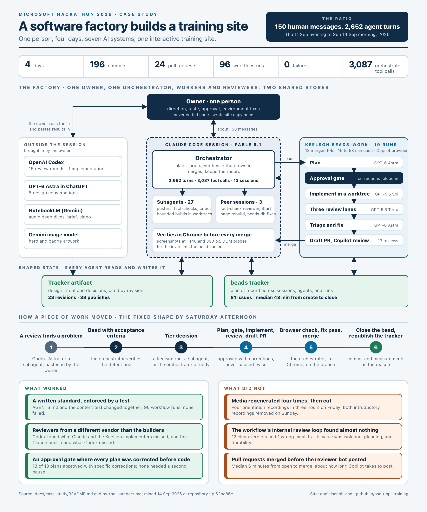
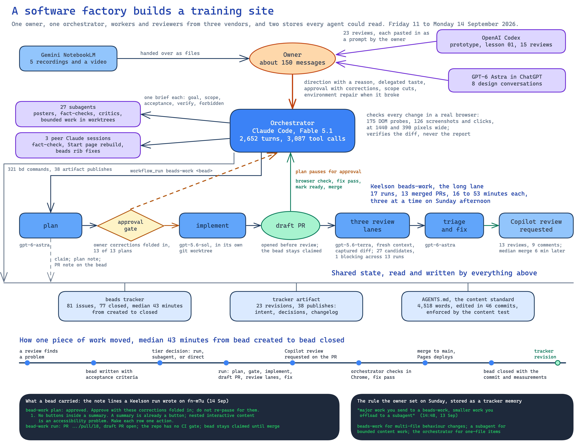

# A software factory builds a training site

**Microsoft Hackathon 2026. One engineer, four days, agents from Anthropic, OpenAI, and Google, one interactive training site.**

This is the short case study. The [full record](full-record.md) has the day-by-day account, the tool-by-tool assessment, and the quotations (also rendered as [a PDF](full-record.pdf), the source for a generated audio conversation about the build); the [numbers](by-the-numbers.md) carry their sources and a cutoff; the [usage analysis](usage/README.md) shows where the tokens went. I set the direction and made the calls described here. A Claude Code session wrote most of the words, including these, from the records of what happened; where a sentence reports something only the records could know, that is the session speaking, not my memory.

## The problem, and the experiment

Engineers who know OSDU (the Open Subsurface Data Universe, an open data platform for the energy industry) still take weeks to become productive on its Azure SPI Stack (SPI is the Service Provider Interface, the seam where each OSDU service calls cloud-specific code) and on the engineering system that keeps the Azure service forks current with upstream. The documentation is complete, but complete is the problem: architecture guides, deployment guides, identity guides, decision records, and a fork workflow across three repositories. Reading does not build the mental model. You need to see the stack, trace one request through it, watch a change travel from a fork to a running image, and then read with that picture in your head.

So the deliverable was a training site, [OSDU Azure SPI Fieldnotes](https://danielscholl-osdu.github.io/osdu-spi-training/): seven lessons over an inspectable architecture map, each a small set of claims that focus the map when selected, with an evidence drawer, one easy mistake, an optional hands-on activity, and a shelf of deeper material; around them two generated audio deep dives with chapter markers and source-check notes, a short video, eight field guides, and six posters. Every explanation must name something checkable against the source repositories, and a content test cross-checks every route, marker, and component before a build can deploy.

The experiment was how to build it. I acted as a manager rather than a coder and put a factory of AI agents to work, deliberately drawn from more than one vendor, with two pieces of shared state that every agent could read: an issue tracker and a design-intent document. The question was whether one person could get something this size built and reviewed that way, and what the person actually has to do.

## What existed before

The four days integrated a factory; they did not build one. Already in place: the three source repositories and their documentation; two supplied PDF guides; Keelson, my local agent workbench, with its beads rib and the beads-work workflow, written earlier in the summer for other projects; the beads issue tracker; the Claude Code skills for posters, diagrams, and briefs; the Chrome extension; the Codex CLI; NotebookLM. And on Friday afternoon, before any Claude session, I worked with OpenAI Codex to build the five-file prototype, lay out the source tree, and implement the first response to a concept review. Built during the event: the site, the content standard in `AGENTS.md`, the content test, the tracker artifact, the bead conventions, and the delegation rules.

## The operating model

A few terms, since the rest of this page uses them. A **bead** is an issue in the beads tracker. A **worktree** is an isolated git checkout, so an agent can change files without touching anyone else's working copy. **MCP** is the connection a coding agent uses to call an external tool such as Keelson. A **compaction** is what happens when a long agent session runs out of context and summarises itself; whatever is not written down elsewhere is lost. A **lane** is one independent reviewer inside a workflow run. **Pages** is GitHub Pages, where every push to main deploys the site. Astra, Sol, Terra, and Luna are OpenAI model variants (GPT-6 Astra, GPT-5.6 Sol, and so on), not people.

**Who decided.** I did: direction with a reason, taste, approval of plans, scope cuts, and which review to bring in. About 150 messages over four days, roughly 15 to 21 hours of active attention by the message timestamps, plus time in Codex, ChatGPT, and NotebookLM that the transcripts do not see. I never edited code, and supplied site copy once, by picking three paragraphs from a Codex suggestion and passing them across.

**Who built.** Thirteen Claude Code sessions did the Claude side, on Opus 5 for Friday and Saturday and Fable 5.1 from Sunday. One 25-hour session that opened on Sunday morning was the orchestrator: 1,301 turns, 86 messages from me, every Keelson call. It wrote briefs, spawned subagents for parallel and adversarial work, handed multi-file changes to Keelson, checked every change in a real browser at two widths, merged, and kept the record. Across all thirteen sessions the transcripts show 2,652 turns, 3,087 tool calls, and 27 subagents. Claude Code wrote more output tokens than any other channel, because it was also writing the content. Keelson's beads-work workflow ran 17 times and merged 13 pull requests; inside a run, GPT-6 Astra planned and triaged, GPT-5.6 Sol implemented in a worktree, and GPT-5.6 Terra ran three review lanes, all through the GitHub Copilot provider.

**Who checked.** Reviewers that had not built the change. Codex reviewed the deployed site fifteen times for usability, accuracy, and voice, on its own branches, and I carried each review across as a prompt. GPT-6 Astra in ChatGPT shaped the design in eight conversations. GitHub Copilot reviewed every workflow-built pull request. A second Claude session fact-checked the whole site once and found 21 things, including that the running example's cache fix had been written upstream, not in the fork. Before three of my cuts I asked for the case against the thing being cut: two adversarial subagents and one inline argument. I chose reviewers from different vendors than the builders on purpose, but the record cannot show that the vendor, rather than the fresh context, is what mattered; every vendor ended up on both sides of the table.

**What persisted.** A beads tracker: 81 issues by the end of the build, with acceptance criteria that could be measured and close reasons that name the commit and the measurement. Of the 49 closed beads whose close reason names a commit, 41 were created before that commit; the other 8 were written after the fact to record a review or a two-minute fix. A design-intent document, kept as a Claude artifact through 23 revisions, that reviewers could cite by revision. And `AGENTS.md`, the content standard that every agent read and the test enforced, edited in 46 commits and 4,518 words long by the end.

**Keelson, beads, and the rib between them.** Three of those tools are mine. Keelson is a local agent harness that keeps conversations, workflow runs, outputs, and memory in a local database so agent work survives a closed terminal, and runs repeatable work as deterministic YAML workflows with approval gates, routing each step to whichever model suits it ([repository](https://github.com/danielscholl/keelson), [docs](https://danielscholl.github.io/keelson/)). beads is an issue tracker that lives in the repository with a command line; it suits agents because every bead declares what blocks it, carries acceptance and a close reason, and costs milliseconds to update. The beads rib ([repository](https://github.com/danielscholl/keelson-rib-beads)) gives me a live board of the backlog and gives Keelson the beads-work workflow: claim, plan, pause for approval, implement in a worktree, open a draft pull request, review the diff in three lanes, fix, write the outcome back, never close. The [full record](full-record.md#keelson-beads-and-the-rib-between-them) has the longer description.

## Three decisions that changed the process

**1. Sunday 11:03: move the work into a tracker and a workbench.** Until then the project had a git history and some iteration notes. I wrote: "Perhaps we use beads to coordinate our work. We have access to keelson, you have access to a coding agent peer. Your goal is to orchestrate work and get the work accomplished as you see fit best but control your context and try to delegate, review and orchestrate/coordinate what your plan ends up being." The first hour was rough: Keelson refused connections and I restarted it twice, the beads-work workflow was not installed on the project yet, the Chrome extension paired on the fourth try, and a headless browser hung. I noticed that one first: "I think the agent is waiting on a failed chrome process." By 12:43 the first two runs were building lessons 02 and 03 in parallel; between 14:06 and 15:32 seven more produced pull requests #7 to #13. At 13:12 I said what I saw: "the software factory is working good. It takes a little longer but is more involved in adversarial reviews and fixes as part of the workflow." (Quotes from my messages are lightly corrected for spelling.)

**2. Sunday 14:48: scope runs for worth.** This was a choice, not a measurement. A beads-work run took 16 to 53 minutes, median 26. A subagent doing a bounded task in a worktree took 11 to 16 minutes in the five cases the transcripts show. I chose runs for changes that crossed files and changed behaviour, because the plan gate caught things before code was written and the isolation kept three runs from colliding; subagents for the rest, because a run cost about twice the time and I often adjusted the result anyway. I did not measure whether runs produced fewer defects. "Major work you send to a beads-work, smaller work you offload to a subagent," I wrote, and the orchestrator stored it as a tracker memory with the reasoning. The transcripts show six compactions between that message and Monday morning, when the rule was applied without being restated: I cancelled a run two minutes in ("It takes 40 minutes and we often have to adjust. This might be a better task to delegate to a subagent") and a subagent finished it in six.

**3. Ask for the argument, then cut.** Three things confused me as a reader and were removed the same day they were built: a "You are Here" bar, a map-jump navigation, and an Explore mode. Three generated posters were retired and two introductory recordings were taken off the deep-dives listing. Before each cut I asked for the case against it, read it, and decided. None of the six removals was reversed before the build ended. What I would change is the order: ask for that argument before building an interaction feature, not only before removing one.

## One change through the factory

The Go deeper shelf, Monday morning: the longest of the thirteen runs, chosen because it is the most complete record. At 08:28 I pasted a reviewer's note: after the lesson exit "the page asks the reader to decode four treatments ... On lesson 01 the optional band is 891px of a 3,551px page." At 08:51 the orchestrator wrote a bead with a seven-point design and acceptance that could be measured: the collapsed band under 350 pixels on desktop, every route unchanged, the check green. It started a run. Astra planned; the orchestrator approved with corrections ("No buttons inside a summary ... nested interactive content is an accessibility problem"). Sol implemented for 33 minutes in a worktree. The run opened draft PR #18 at 09:33, ran its three lanes on the diff, found nothing blocking, and requested Copilot, which posted six findings at 09:49, two of them real. The orchestrator opened the branch in Chrome and measured: shelf 261 pixels and page 2,658 at 1280 wide, was 891 and 3,551; one fix, so that shelf rows stay open within a chapter; merged at 10:22. The bead closed with those numbers as its reason and the tracker went to revision 18. The reviewer's follow-up ("calmer, but a little too much like a reference table") became a second bead the orchestrator did directly in six minutes.

A typical run was shorter and less well attended. The Redis and Table Storage correction in lesson 03 (bead fn-kbc, Sunday 14:06) ran 16 minutes, opened PR #7, and merged seven minutes after opening; Copilot's one comment arrived a minute after the merge.

## What the evidence shows

What was delivered: seven lessons, two deep dives with markers and source-check notes, a video, eight field guides, six posters, and a content standard with a test that enforces it. What the checks found and fixed: 91 findings from the concept review triaged into the first iteration; 21 fact-check findings from the peer session; Codex's routing defect, provider-explanation error, and the Redis-inside-AKS versus Table-Storage-outside boundary error; three interaction features built and removed. Four layers of checking did different jobs and only one was automatic: the content test proved the structure held; reading the source repositories proved the facts; the browser pass proved the behaviour; the pilot with real learners, still to run, will prove whether it teaches. Volume, for scale: 196 commits, 24 merged pull requests, 82 deployments from 83 pushes, no failed run in GitHub Actions; the numbers appendix has the rest.

What it cost, as far as the records allow. Tokens across the three channels with a ledger: 30.8 million new input, 904 million cached reads, 4.05 million output. Keelson used the most new input (14.9 million, mostly the implement step reading the repository fresh each run), Claude Code wrote the most output (2.3 million), and 97 percent of all input was cache reads.

| Unit                                | Rough cost                                                                    | Basis                                                                                                                                                                             |
| ----------------------------------- | ----------------------------------------------------------------------------- | --------------------------------------------------------------------------------------------------------------------------------------------------------------------------------- |
| One Keelson-built pull request      | 1.1 M new input and 0.1 M output tokens, one Copilot review, 16 to 53 minutes | 14.86 M and 1.32 M across 13 merged PRs; metered on a Copilot subscription                                                                                                        |
| One orchestrator-built pull request | about $10 of the Claude ledger if spread across all 24 PRs                    | the Claude Code cost ledger shows about $251 for the sessions that logged it, indicative and not a bill; most of it went to content, media, and reviews rather than pull requests |
| Codex and ChatGPT reviews           | flat monthly subscriptions                                                    | 710 Codex responses, 5.35 M new input                                                                                                                                             |

Nobody saw one number, and no billing statement was consulted.

What was expensive: media. Four orientation recordings in three hours on Saturday, then both introductory pieces demoted on Sunday because a learner who started there would never reach the deep dives. The rule that came out of it, script first, then record from the approved script, would have saved Saturday afternoon. Also expensive: the workflow's internal review loop, which raised 27 candidates across 13 runs and blocked once, on a real gap whose remedy (a Playwright test the project forbids) had to be reverted. The defects that changed the product were visual and behavioural; they were found in the browser and by outside reviewers, not by lanes reading a diff. And pull requests merged before Copilot posted: six of its nine inline comments arrived after the merge.

What broke, and who could have fixed it: the tracker silently reverted closures twice on Sunday, first from a tracked export, then from its own git hooks under parallel worktrees, and I had to ask why. Keelson refused connections twice, the MCP link needed reconnecting, the Chrome extension needed four pairing attempts and dropped again on Monday, a headless browser hung, and one run failed on a missing Copilot package. Of those, one needed me as the author of the tools: the beads rib's handling of dotted bead ids, which a subagent patched in the rib's own repository. The rest a user could do from the docs. Together the repairs took roughly two of the 15 to 21 hours, most of them in the first hour on Sunday. Reconstructing who said what for this case study took five research agents an hour, because none of the review documents names its author and the tracker records one actor for everything.

Where my hours went, roughly, from the shape of the transcripts: reading and carrying reviews across, 4 to 5 hours; looking at the site and giving taste judgements, 5 to 6; direction and process rules, 3; environment repair, 2; approving plans, under 1, because I had delegated most approvals to the orchestrator. Time in Codex, ChatGPT, and NotebookLM is not in the transcripts, and I have not estimated it, so the total is a floor.

What remains unmeasured: whether the site shortens onboarding; whether the factory saved labour against building it by hand; whether this mix of tools beats another; and the total cost as one number.

## The setup I would use next time

1. Tracker and design-intent document from the first hour, not day three, with the tracker's export and hooks configured before any parallel worktree exists.
2. A content standard and a test that fails the build, written before the first agent-built change.
3. Delegation tiers stated on the first run: workflow runs for behaviour changes across files, subagents for bounded content work, direct edits for one-file items. Then measure defects by tier, which I did not.
4. A reviewer that did not build the change, named in the prompt at paste time so the record keeps the attribution.
5. Hold a pull request until its review bot has posted, or turn the bot off.
6. Script, review, record. Never regenerate a recording to fix a framing problem.
7. Ask for the adversarial argument before building an interaction feature, not only before removing one.
8. Status to the owner as one line plus open items.
9. Every provider's spend in one place, even a spreadsheet.

The site is live. The pilot, the personal-account walkthrough that gates two of the hands-on bands, and the re-recording from approved scripts are the three things still waiting on me.
