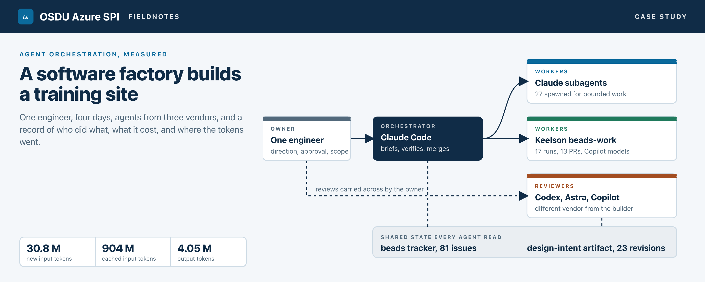
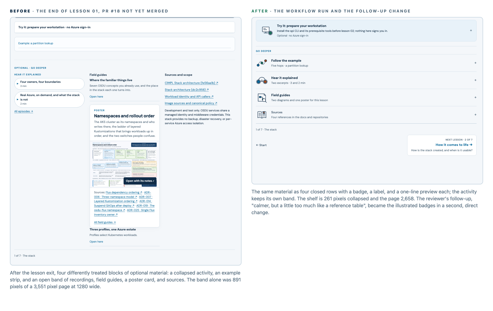
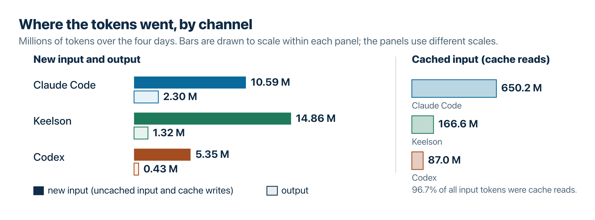

# A software factory builds a training site

**Microsoft Hackathon 2026. One engineer, four days, agents from Anthropic, OpenAI, and Google, one interactive training site.**

**[Watch](https://danielscholl-osdu.github.io/osdu-spi-training/case-study/media/the-one-man-ai-software-factory.mp4)** the one-minute video overview, or **[listen](https://danielscholl-osdu.github.io/osdu-spi-training/case-study/media/the-four-day-ai-software-factory.m4a)** to the 45-minute audio deep dive, both generated by NotebookLM from the full record.

## The problem, and the experiment

Engineers who already know OSDU, the open data platform the energy industry uses for subsurface data, still take weeks to become productive on its Azure implementation. The reason is not missing documentation. The information is spread across three repositories and a stack of guides: architecture, deployment, identity, decision records, and the workflow that keeps the Azure service forks current with upstream. Reading them in order does not build the mental model. An engineer needs to see the stack, trace one request through it, watch a change travel from a fork to a running image, and then read with that picture in mind.

So the deliverable was a training site, [OSDU Azure SPI Fieldnotes](https://danielscholl-osdu.github.io/osdu-spi-training/): seven lessons over an inspectable architecture map, with recordings, field guides, and posters around them. The rule that shaped every part of it was that each explanation must name something checkable against the source repositories, and a content test enforces the structure before any build can deploy.

The source repositories and their documentation, the beads tracker, Keelson with its beads integration and workflow, and the Claude Code skills for posters and briefs all existed before the four days began. On the first afternoon the engineer built the five-file prototype with OpenAI Codex, before any Claude session; a Claude Code session took on orchestration from the third morning.

The experiment was how to build it. The engineer acted as a manager rather than a coder and put a factory of AI agents to work, deliberately drawn from more than one vendor, with two pieces of shared state that every agent could read: an issue tracker and a design-intent document. The question was whether one person could get something this size built and reviewed that way, and what that person actually has to do.

## The operating model

**Keelson** is a local agent workbench the engineer wrote earlier in the summer: it keeps conversations, workflow runs, and memory in a local database so agent work survives a closed terminal, and it runs repeatable work as YAML workflows with approval gates, routing each step to whichever model suits it ([repository](https://github.com/danielscholl/keelson), [docs](https://danielscholl.github.io/keelson/)).

**beads** is an open-source issue tracker that lives in the repository with a command line; it suits agents because every issue, called a bead, declares what blocks it, carries acceptance criteria and a close reason, and costs milliseconds to update.

The beads integration ([repository](https://github.com/danielscholl/keelson-rib-beads)) connects the tracker to Keelson: a live board of the backlog, and the beads-work workflow, which takes a bead through plan, approval, implementation in an isolated checkout, a draft pull request, three independent reviews of the diff, fixes, and a write-back to the bead. The [full record](full-record.md#keelson-beads-and-the-rib-between-them) describes the design and its cost in time.

**Who decided.** The engineer set direction with a reason, reviewed the design, approved plans, cut scope, and chose which review to bring in. About 150 messages over four days, and roughly 15 to 21 hours of active attention by the message timestamps, plus time in Codex, ChatGPT, and NotebookLM that the transcripts do not see. The engineer never edited code and supplied site copy once, by picking three paragraphs from a Codex suggestion and passing them across.

**Who built.** One Claude Code session was the orchestrator from the third morning to the end. It wrote briefs, spawned subagents for parallel and adversarial work, handed multi-file changes to Keelson, checked every change in a real browser at two widths, merged, and kept the record. It also wrote more than any other channel, because it was writing the content as well as coordinating. Subagents did bounded work in their own checkouts: posters, fact-checks, a rebuilt page. The beads-work workflow built the larger changes, with OpenAI models reached through GitHub Copilot doing the planning, implementation, and review inside each run, and merged thirteen pull requests. The model assignments are in the [detailed diagram](factory-diagram.png) and the [usage analysis](usage/README.md); the counts are in the [numbers appendix](by-the-numbers.md).

**Who checked.** Reviewers that had not built the change. OpenAI Codex reviewed the deployed site fifteen times for usability, accuracy, and voice, and the engineer carried each review across as a prompt. GPT-6 Astra in ChatGPT shaped the design over eight conversations. GitHub Copilot reviewed every workflow-built pull request. A second Claude session fact-checked the whole site once and found 21 things, including that the running example's cache fix had been written upstream, not in the fork. Reviewers were chosen from different vendors than the builders on purpose, but the record cannot show whether the vendor or the fresh context is what mattered; every vendor ended up on both sides of the table.

**What persisted.** The beads tracker, 81 issues by the end, with acceptance criteria that could be measured and close reasons that name the commit and the measurement; most beads were written before the code, a few after the fact to record a review or a two-minute fix. A design-intent document, kept as a Claude artifact through 23 revisions, that reviewers could cite by revision. And `AGENTS.md`, the content standard every agent read and the test enforced.

## Three decisions that changed the process

**1. Day 3, 11:03: move the work into a tracker and a workbench.** Until then the project had a git history and some iteration notes. The engineer wrote: "Perhaps we use beads to coordinate our work ... Your goal is to orchestrate work and get the work accomplished as you see fit best but control your context and try to delegate, review and orchestrate." The first hour was rough: Keelson refused connections and was restarted twice, the workflow was not installed on the project yet, the Chrome extension paired on the fourth try, and a headless browser hung. The engineer noticed that one first: "I think the agent is waiting on a failed chrome process."

By 12:43 the first two runs were building lessons in parallel. At 13:12 the engineer wrote: "the software factory is working good. It takes a little longer but is more involved in adversarial reviews and fixes as part of the workflow." By mid-afternoon nine runs had produced pull requests, three of them at a time. (Quotations from the engineer's messages are lightly corrected for spelling.)

**2. Day 3, 14:48: use the full workflow only for larger changes.** A workflow run took 16 to 53 minutes, median 26. A subagent doing a bounded task took 11 to 16 minutes in the five cases the transcripts show. Runs went to changes that crossed files and changed behaviour, because the plan gate caught things before code was written and the isolation kept three runs from colliding. Subagents took the rest, because a run cost about twice the time and the result often needed adjustment anyway. Whether runs produced fewer defects was not measured.

"Major work you send to a beads-work, smaller work you offload to a subagent," the engineer wrote, and the orchestrator stored it as a tracker memory with the reasoning. On the fourth morning the engineer applied the rule by cancelling a run two minutes in ("It takes 40 minutes and we often have to adjust. This might be a better task to delegate to a subagent"); a subagent finished the job in six. The memory survived six compactions of the session in between. Whether the orchestrator would have applied the rule unprompted, the record cannot say.

**3. Ask for the argument, then cut.** Three features confused the engineer as a reader and were removed the same day they were built: a "You are Here" bar, a map-jump navigation, and an Explore mode. Three generated posters were retired and two introductory recordings were taken off the deep-dives listing. Before each cut the engineer asked for the case against it, read it, and decided. None of the removals was reversed before the build ended. The change for next time is the order: ask for that argument before building an interaction feature, not only before removing one.

## One change through the factory

The Go deeper shelf on the fourth morning was the longest of the thirteen runs, and the most complete record of one. It began with a reader's problem. A reviewer wrote that after the lesson exit "the page asks the reader to decode four treatments": a collapsed activity, an example strip, and an open band of recordings, guides, a poster, and sources, each styled differently. On lesson 01 the optional band was 891 pixels of a 3,551 pixel page. The optional material was overwhelming the lesson's ending.

The engineer passed the review to the orchestrator. Within half an hour it had written a bead with a seven-point design and acceptance criteria that could be measured: the collapsed band under 350 pixels on desktop, every route unchanged, all checks passing. It started a workflow run. Astra planned; the orchestrator approved with corrections ("No buttons inside a summary ... nested interactive content is an accessibility problem"); Sol implemented for 33 minutes in its own checkout.

The run opened a draft pull request, reviewed the diff in its three lanes, found nothing blocking, and asked Copilot for a review, which posted six findings, two of them confirmed issues. The orchestrator opened the branch in Chrome and measured: shelf 261 pixels and page 2,658 at 1280 wide, against 891 and 3,551 before. One fix, so that shelf rows stay open within a chapter, and it merged. The bead closed with those numbers as its reason.

Passing the measurable requirement did not finish the design work. The reviewer's follow-up, "calmer, but a little too much like a reference table", became a second bead the orchestrator did directly in six minutes: the illustrated badges on each row. A typical run was shorter and less well attended than this one: the Redis and Table Storage correction in lesson 03 ran 16 minutes and merged seven minutes after its pull request opened, and Copilot's one comment arrived a minute after the merge.

## What the evidence shows

**Review and visual judgement still needed a person.** The defects that changed the product were visual and behavioural, and they were found in the browser and by outside reviewers, not by the workflow's lanes reading a diff. The lanes raised 27 candidates across 13 runs and blocked once, on a real gap whose remedy, a Playwright test the project forbids, had to be reverted. Of the engineer's hours, reading and carrying reviews across took 4 to 5, and looking at the site and giving taste judgements 5 to 6; approving plans took under one, because most approvals had been delegated to the orchestrator.

**The full workflow added time and was not worth it for every change.** A run cost about twice what a subagent did on a bounded task, and the result usually needed adjustment anyway. What the run bought was the plan gate, the isolation that let three runs proceed at once, and a record of plan, diff, review candidates, and measurements written to the bead. In the cases reviewed, the orchestrator handled copy edits, configuration changes, and one-file fixes satisfactorily in less time.

**Some review feedback arrived too late to gate a merge.** Six of Copilot's nine inline comments were posted after the pull request had merged; the median merge was six minutes after opening. A factory that opens and merges its own pull requests has to decide whether the reviewer bot is a gate or a comment, and this one treated it as a comment.

**Media was the expensive rework.** Four orientation recordings in three hours on Day 2, then both introductory pieces demoted the next day over the concern that a learner who started there would be pulled away from the deep dives. The rule that came out of it, script first and record from the approved script, would have saved the afternoon.

**What broke.** The tracker silently reverted closures twice on Day 3, first from a tracked export and then from its own git hooks under parallel checkouts, and the engineer had to ask why. Keelson refused connections twice, the Chrome extension kept dropping, and one run failed on a missing package. Only one failure needed the author of the tools, a bead-id bug in the beads integration that a subagent patched; the rest a user could have fixed from the documentation. The repairs took roughly two of the 15 to 21 hours.

**What it cost.** Three of the channels keep a usage ledger: Claude Code, Keelson, and Codex. Together they recorded 30.8 million new input tokens, 904 million cached reads, and 4.05 million output tokens. Keelson used the most new input, because each run reads the repository fresh; Claude Code wrote the most output, because it was writing the content; 97 percent of all input was cache reads. The usage records were not reconciled into a total cost. Claude Code keeps a running estimate, Keelson's models are metered on a Copilot subscription, Codex and ChatGPT on their own, and no billing statement was consulted. The [usage analysis](usage/README.md) has the model and role breakdown.

**What remains unmeasured.** Whether the site shortens onboarding: the content test checked the structure, reading the source repositories checked the facts, the browser pass checked the behaviour, and a pilot with real learners, still to run, will assess whether it teaches. Whether the factory saved labour against building the site by hand. Whether this mix of tools beats another. And the total cost as one number.

## Changes for the next build

1. Tracker and design-intent document from the first hour, not the third day, with the tracker's export and hooks configured before any parallel checkout exists.
2. A content standard and a test that fails the build, written before the first agent-built change.
3. Delegation tiers stated on the first run: workflow runs for behaviour changes across files, subagents for bounded content work, direct edits for one-file items. Then measure defects by tier, which this build did not.
4. A reviewer that did not build the change, named in the prompt at paste time so the record keeps the attribution.
5. Hold a pull request until its review bot has posted, or turn the bot off.
6. Script, review, record. Never regenerate a recording to fix a framing problem.
7. Ask for the adversarial argument before building an interaction feature, not only before removing one.
8. Status to the engineer as one line plus open items.
9. Every provider's spend in one place, even a spreadsheet.

The site is live. Three activities remain: the pilot, the personal-account walkthrough that gates two of the hands-on bands, and the re-recording from approved scripts.

The record also shows where the engineer's time went, and it was not where the manager's version of coding would put it. Routine plan approvals took less than an hour after delegation to the orchestrator. Most recorded human effort went into reading reviews, assessing the site as a learner, and resolving tool failures. Several working features were removed because they made the lessons harder to follow. The agents could build almost anything described to them and could argue against it when asked. What they could not supply was the judgement of whether a page taught, and the decision to remove something that worked.

## Supporting material

- The [full record](full-record.md) of the four days, also rendered as [a PDF](full-record.pdf), and the source for the recordings above.
- [By the numbers](by-the-numbers.md): the counts, their sources, and the cutoff.
- The [usage analysis](usage/README.md): tokens by channel, model, and role.
- The [one-page poster](software-factory.png) and the [detailed factory diagram](factory-diagram.png), standalone versions of the picture at the top.
- Repository copies of the [video](media/the-one-man-ai-software-factory.mp4) and [audio](media/the-four-day-ai-software-factory.m4a) overviews.
