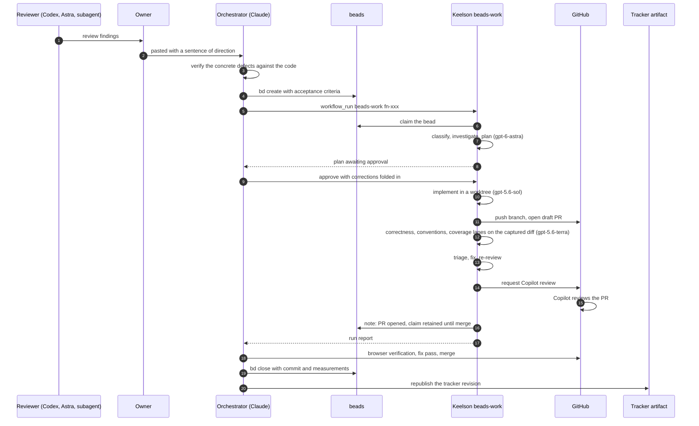
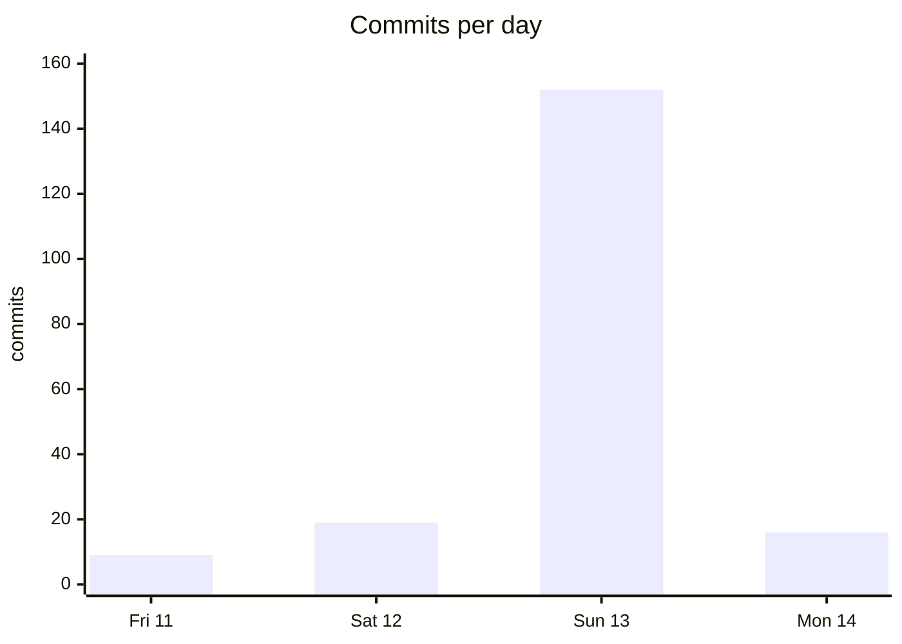
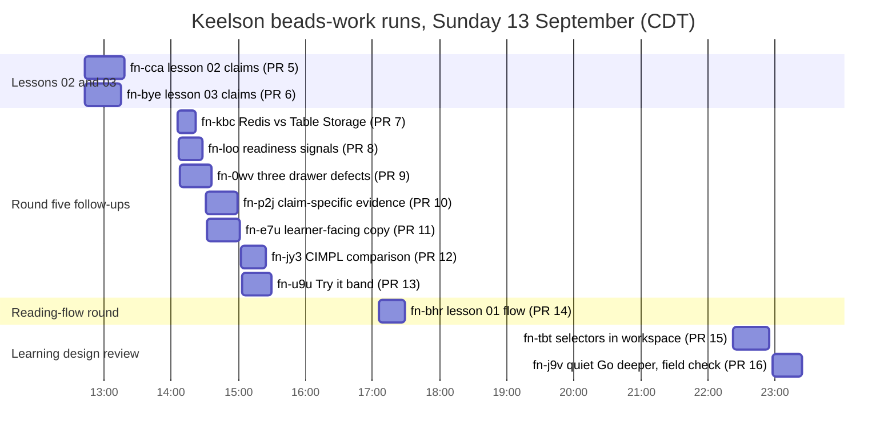

# A software factory builds a training site: the full record

**Microsoft Hackathon 2026. One person, four days, a factory of AI agents from three vendors, one interactive training site.**

This is the long form of the case study, kept as the documentary record and as the source for a generated audio conversation. It was compiled by the orchestrating Claude session from the transcripts, the tracker, the git history, and the Keelson ledger, and it is written in the third person on purpose; the [short case study](README.md) is the owner's first-person account. The [short case study](README.md) is the read for most people. Every figure here is in the [numbers appendix](by-the-numbers.md) with its source; the token and model analysis is in [usage/](usage/README.md).

This is the case study half of the project. The other half is the site itself: [OSDU Azure SPI Fieldnotes](https://danielscholl-osdu.github.io/osdu-spi-training/), an interactive course that teaches senior OSDU engineers how the Azure SPI Stack and its fork engineering system work. The site is the deliverable. The question behind the hackathon was whether a single engineer, acting as a manager rather than a coder, could get a product of that size built and reviewed by a factory of AI agents spanning Claude, OpenAI, and GitHub Copilot, with a durable shared record that survived every session boundary.

The short answer is yes, with costs that are easy to underestimate and a division of labour that only became clear halfway through. What follows is how it went, drawn from the session transcripts, the issue tracker, the git history, and the run ledger of the workflow engine. Every number and quotation below is taken from those records; the [numbers appendix](by-the-numbers.md) lists them with their sources.

## What was built, in one paragraph

The site has seven lessons that walk an engineer down the Azure stack, into one service's provider code, out to the service fork that owns that code, and back in through the image lock that deploys it. Each lesson is a set of claims over an inspectable architecture map, with an evidence drawer, one easy mistake, an optional hands-on activity, and a shelf of deeper material. Around the lessons sit two hour-long generated audio deep dives with chapter markers and source-check notes, a one-minute video, eight field guides drawn as SVG, and six posters. The content is held to a written standard: every explanation must name an artifact, command, resource, number, or failure mode that can be checked against the source repositories, and a content test cross-checks every route, marker, and component before a build can deploy. The result is 196 commits, 24 pull requests, and 82 deployments to GitHub Pages from 83 attempts, with no failed run in GitHub Actions. The checks establish structural integrity: every route, marker, and component resolves. Factual accuracy came from reading the source repositories; learning effectiveness is still to be measured by the pilot.

## The factory

The word "factory" is the owner's. What it meant in practice was one orchestrating session that never wrote most of the code itself, a set of specialised agents it could hand work to, a review layer that was deliberately drawn from different vendors, and two pieces of shared state that every agent could read: an issue tracker and a design-intent document.

The drawing is kept as an editable Excalidraw file beside the image (`factory-diagram.excalidraw`). The numbers on it come from the [appendix](by-the-numbers.md).

### The cast

| Agent              | Vendor and model                                                                                   | Reached through                     | Role                                                                                                                                                                                                                                    | Volume                                                            |
| ------------------ | -------------------------------------------------------------------------------------------------- | ----------------------------------- | --------------------------------------------------------------------------------------------------------------------------------------------------------------------------------------------------------------------------------------- | ----------------------------------------------------------------- |
| Orchestrator       | Anthropic Claude Fable 5.1 (Opus 5 in the first two days)                                          | Claude Code terminal                | Planning, briefing, verification, merging, the written record                                                                                                                                                                           | 13 sessions, 2,652 turns, 3,087 tool calls                        |
| Subagents          | Claude, spawned from the orchestrator                                                              | Agent tool                          | Parallel posters, fact-checks, adversarial reviews, bounded implementations in worktrees                                                                                                                                                | 27 spawns, 829 turns                                              |
| Peer sessions      | Claude Code, separate terminals                                                                    | Session messaging                   | An independent fact-check reviewer; a Start page rebuild; fixes to the Keelson beads rib                                                                                                                                                | 3 sessions                                                        |
| Keelson beads-work | OpenAI GPT-5.6 and GPT-6 Astra, Claude Sonnet 5 and Haiku 4.5, through the GitHub Copilot provider | Keelson MCP server                  | Plan, approval gate, implementation in a worktree, draft PR, three-lane review of the captured diff, triage and fixes, tracker write-back                                                                                               | 17 runs, 13 merged PRs                                            |
| Codex              | OpenAI GPT-6 Astra (138 responses at medium effort, 572 at xhigh)                                  | Codex CLI and the ChatGPT Codex app | The five-file prototype, the source layout, and the first review response on Friday 11 September, before the first Claude session; the lesson 01 rebuild; usability, editorial, and source-checked reviews on `codex/review-*` branches | 7 tasks, 710 responses: 15 review rounds, 3 implementation passes |
| Astra              | OpenAI GPT-6 Astra                                                                                 | ChatGPT                             | Design direction: the story, map, inspector model; the lesson grammar; the lesson footer                                                                                                                                                | 8 conversations                                                   |
| Copilot reviewer   | GitHub Copilot pull request review                                                                 | GitHub                              | Automatic review of every Keelson PR                                                                                                                                                                                                    | 13 reviews                                                        |
| NotebookLM         | Google Gemini                                                                                      | NotebookLM                          | Two deep-dive conversations, a brief, and a video from written sources                                                                                                                                                                  | 5 generations                                                     |
| Gemini image model | Google Gemini 2.5 Flash Image                                                                      | API                                 | Hero strip, episode badges, drafting-sheet strip                                                                                                                                                                                        | 6 images                                                          |
| beads              | `bd`, a Dolt-backed issue tracker                                                                  | CLI and the Keelson beads rib       | Plan of record across sessions, agents, and workflow runs                                                                                                                                                                               | 81 issues, 321 commands                                           |
| Tracker artifact   | A Claude artifact page                                                                             | Claude Code Artifact tool           | Design intent, decisions, and a changelog that reviewers could target by revision                                                                                                                                                       | 38 publishes                                                      |

The owner directed all of it. Across the four days they sent about 150 messages to the Claude sessions, and the orchestrator produced 2,652 turns in reply. That ratio describes activity, not effort. The agents took many intermediate steps between check-ins, the early Codex work sits outside this count entirely, and the owner's active attention, estimated from message timestamps, was roughly 15 to 21 hours across the four days plus time in Codex, ChatGPT, and NotebookLM that the Claude record does not see.

## How a piece of work moved

By Sunday afternoon the factory had a fixed shape. A review found a problem. The orchestrator turned the finding into a bead with checkable acceptance criteria. A tier decision followed: a multi-file behaviour change went to a Keelson beads-work run, a bounded content change went to a subagent in a worktree, and a one-file fix was made directly. A Keelson run planned, paused for approval, implemented, opened a draft pull request, then reviewed the captured diff in three lanes and fixed what triage kept. The orchestrator then opened the site in Chrome, took screenshots at 1440 and 390 pixels, probed the DOM for the invariants the bead named, made a fix pass on the branch, merged it, closed the bead with the commit and the measurements as the reason, and republished the tracker.

The approval gate is where judgement entered a run. The owner had delegated the approvals to the orchestrator ("be aware for keelson when running a workflow you'll have to approve the workflow plans"), and the orchestrator approved all thirteen plans with corrections it wrote against the bead and the content standard. The corrections were specific. On the Go deeper shelf run: "No buttons inside a summary. Do not place the play chips inside the Hear it explained summary. A summary is already a button; nested interactive content is an accessibility problem." On the lesson 01 run: "Never run bd close on any bead, including fn-bhr and fn-7vh at the end of Task 7; the merge closes them." On the Try it run: "Drop cost: free|billable and costConditions. Use variant.access, exactly one of: browser only, workstation setup, public GitHub repository, Azure resources billed separately." The run then carried those corrections into implementation without pausing again.

## Four days

**Friday.** The project did not begin with Claude. During Friday the owner worked with OpenAI Codex to build the five-file prototype, and that evening Codex went on to establish the source layout and development checks and to implement the first response to the concept review, which became commit `baa216b`. The Claude side began at 17:10 as a review request, not a build request. The owner asked for "detailed feedback in areas of design, content, accuracy, creativity, engagement." The orchestrator ran it as a workflow: ten review lenses (accuracy of the stack claims, accuracy of the SPI claims, pedagogy, narrative, visual, accessibility, engagement, extensibility, front-end code, gaps), each verified by a second agent, then an editor's synthesis and a completeness critic. Ninety-one findings survived. The verdict line was "The map is right. The panels are empty." The one authoring rule it proposed, that every explanation must carry a fact you could only know from having run the system, became the first line of the content standard and never left it. The repository was initialised at 17:28 and the concept review was committed into it at the owner's request.

**Saturday.** Media day. The owner brought a NotebookLM deep dive, two infographics, and a brief: "The reality is that just reading documentation is very hard. Diagrams, infographics, audio etc all can be used to help supplement the learning process and really capture the imagination of the engineer." Three poster subagents ran in parallel, each briefed with the infographic skill, and each came back having corrected the orchestrator's brief against the stack documentation. The site went public on GitHub Pages at 20:02 Friday night. On Saturday morning the first Codex review arrived, pasted as a prompt. It found a real routing defect in inline poster links and a factual error about what the partition provider reads. By afternoon the owner wanted the site expanded from the stack alone to the fork engineering system as well, and handed over a 103-page guide, two more recordings, and two infographics. Two subagents outlined the guide and mapped both repositories' documentation; a plan was written and agreed; the fork, day, and seam views were built on a branch and merged through the first pull requests. Late Saturday the owner asked a second Claude session to fact-check the whole site "looking for things that read as AI slop". It returned 21 findings, including that the running example's cache fallback had been written upstream, not in the fork, and that the image path shown on the site was wrong.

Saturday also held the day's most expensive churn. The orientation recording was regenerated four times in three hours as the owner tried to get a conversational introduction that framed the site without repeating the deep dives. The last generation came from a source document the orchestrator wrote specifically for NotebookLM after the owner shared the exact prompt they had been using. On Sunday evening the owner took the orientation and the brief off the Audio deep dives listing, keeping both in the content and the brief on Start, so that nobody would start on the framing and miss the deep dives: "if someone started there which naturally they would they wouldn't get to the content we really want them to listen to."

**Sunday.** At 11:03 the owner introduced the tracker and the workbench: "Perhaps we use beads to coordinate our work. We have access to keelson, you have access to a coding agent peer. Your goal is to orchestrate work and get the work accomplished as you see fit best but control your context and try to delegate, review and orchestrate/coordinate what your plan ends up being." Before that message the project had a git history and a set of markdown iteration records. After it, the project had a tracker, a design-intent document, a workflow engine, and a browser the orchestrator could drive itself.

The first hour was rough. Keelson refused connections; the owner restarted it twice. The beads-work workflow was not installed on the project yet ("yea sorry I guess I haven't fixed the beads-work workflow yet"). The Chrome extension paired on the fourth attempt. A headless Chrome launched by a review agent hung, and the owner noticed before the orchestrator did: "I think the agent is waiting on a failed chrome process." Meanwhile lesson 01 was rebuilt around the new claims-first design by Codex, in parallel with a Claude agent doing the same brief in a separate worktree, because the owner had doubts: "From what I know gpt-6-astra code can often be not very good and it makes a lot of test." The orchestrator's verdict: "Codex is fine for a first draft against a precise spec; the Fable agent was the stronger finisher." A review agent had found ten defects in Codex's draft that its own checks had not; the Fable agent fixed nine cleanly on the first pass. Lesson 01 merged as PR #4 at 11:51.

By 12:38 Keelson was running the beads-work workflow, and the owner set the pace: "This would offload and do the work in a worktree and I think you could get maybe 2 or 3 going in parallel." Lessons 02 and 03 went out as the first two runs at 12:43. Between 14:06 and 15:32 seven more runs produced PRs #7 through #13: the Redis and Table Storage boundary fix, the readiness-signals correction, the three drawer defects, claim-specific evidence, the learner-facing copy edit, the CIMPL comparison, and the Try it band. Sixty-seven commits landed in those two hours. At 13:12 the owner gave the verdict that named the project: "thats good feedback, the software factory is working good. It takes a little longer but is more involved in advesarial reveiws and fixes as part of the workflow."

The afternoon and evening belonged to the reviewers and the owner's eye. Codex reviewed lessons 01 to 03 as implemented (seven follow-ups, all accepted), reviewed the Try it plan before any recipe was written (seven operational corrections, such as the dry run needing Azure access after all), and recommended naming CIMPL as the reference implementation. Astra reviewed the reading flow of Start and the first two lessons. Then, from 18:00 to just after midnight, the owner and the orchestrator worked the landing page together in short turns: the headline ("Maybe something like Understand the Azure SPI Machinery"), the order of the three meanings of SPI, a hero image generated with the Gemini image model at the owner's suggestion, the ban on the phrase "OSDU on Azure" because it named an older product, and finally the intro paragraph: three paragraphs Codex had proposed in a review, which the owner selected and passed across, and which the orchestrator adopted nearly verbatim. By 19:09 on Sunday the owner was satisfied with the landing page.

**Sunday night and Monday morning.** Polish and closure. On Sunday night an adversarial subagent judged nineteen field guides and posters as a demanding learner; three generated posters were retired because each needed a correction list longer than its takeaways. Three Codex passes closed the polish round, and replacement scripts for the recordings were drafted and reviewed. On Monday morning another adversarial pass answered the owner's question about whether Explore mode earned its place ("explore mode then caused me confusion as to am I missing something important?"); it did not, and it was removed. The last Keelson run built the Go deeper shelf, and the owner's review of its result led to the illustrated footer, the pager, and carrying the same shape through every lesson, all done directly by the orchestrator in PRs opened and merged within the same minute. At 11:05 the owner made the last process call: "Do you think running a full bead-work is the best way to do this it. It takes 40 minutes and we often have to adjust. This might be a better task to delegate to a subagent." The run was cancelled and a subagent did the work in six minutes. The final commit landed at 11:36.

## The human's job

The owner never edited code in the record and supplied site copy once, by choosing it from a Codex proposal. What they did instead falls into a small number of kinds, and the kinds matter more than the count.

**Direction with a reason.** Nearly every build request came with a learner-centred why. "The concepts have to flow otherwise a user can easily get lost." "People read top to bottom and might never get to the bottom with a giant Start there button that someone clicks on right away." "Ground all this in reality." The reasons were what the orchestrator could generalise from; the requests alone would not have been.

**Delegated taste.** "I'll follow your recommendation you know what things might be best to communicate and how." "Go ahead and make the changes necessary that you think are appropriate." "Merge and fix and keep me updated as the Lessons come online and I can review and offer my feedback." This is what let the factory run for hours between check-ins.

**Correction by looking.** The owner found what was wrong by using the site, not by reading diffs. The "You are Here" bar ("it isn't really landing for me and it did feel like navigation"), the map-jump navigation ("It causes things to jump and you sort of loose context then as the reader"), the three unexplained lines in a sidebar, a "prototype" badge in the header, a guide group that would not collapse, a lesson footer that felt overloaded. Each was fixed within the hour, and three of them were features that had been built the same day.

**Scope cuts.** Removing the orientation and brief recordings, retiring the posters, removing Explore mode, dropping the "Tested with" table to one line. The owner asked for an adversarial argument before most of these, then decided.

**Process rules, stated once.** Use beads and Keelson. Push to main without pull requests for this project. Approve the workflow plans. "Major work you send to a beads-work, smaller work you offload to a subagent." "Make the choices that you think would provide the best result balanced with token burn and time." The orchestrator wrote these into the tracker's memory so they survived the next session.

**Transport for the reviewers.** Every Codex and Astra review reached the orchestrator because the owner ran it elsewhere and pasted the result, usually with a sentence on top. Fifteen Codex rounds, eight Astra rounds. Every external review reached the factory through the owner.

**Environment repair.** Restarting Keelson, reconnecting MCP, re-pairing the Chrome extension, starting a peer session to fix the beads rib, noticing a hung process. The factory needed hands on the machine several times a day.

There is one more thing the record shows. The owner lost the thread twice late on Sunday night: "so you lost me. Are we good with our open tasks or there are still some left." and, a few minutes later, pasting the orchestrator's own status report back as a prompt. Both came after a night of dense status updates. A factory that reports too much is as hard to manage as one that reports too little.

## Keelson, beads, and the rib between them

Three of the tools in the cast are the owner's own, and the case study assumes a reader has not met them.

**Keelson** is a local agent workbench, a harness that runs on the engineer's machine and is reached from any coding agent over MCP. Its own description is "the hull, not the crew": it owns state, routing, and extensions, and stays separate from any one chat interface or model provider. The problem it exists to solve is that agent work in a chat session is ephemeral. A long task lives only in one context window, dies with the terminal, cannot be re-run, and cannot be inspected afterwards. Keelson keeps conversations, workflow runs, node outputs, usage, and memory in a local database so that work survives restarts and provider changes, and it expresses repeatable work as **workflows**: deterministic YAML graphs that mix agent turns with shell steps, scripts, loops, and approval gates. A workflow can pause for a person, deny or redact a tool call, and route each node to a different model through one provider interface. Ribs are the extension packages; they add tools, workflows, and live boards without forking the core. The repository is [github.com/danielscholl/keelson](https://github.com/danielscholl/keelson) and the documentation is at [danielscholl.github.io/keelson](https://danielscholl.github.io/keelson/).

**beads** is the `bd` issue tracker: a dependency-aware backlog that lives in the repository as an embedded database, with a command line an agent can drive. Three properties make it a better fit for agent work than issues and pull requests on a forge. Every bead can declare what blocks it, so an agent can ask for the ready queue rather than a list, and the tracker can rank by leverage: the bead whose completion unblocks the most downstream work. Every bead carries structured fields an agent can fill and read back, a description, acceptance criteria, design, notes, and a close reason, so the definition of done travels with the work instead of living in a conversation. And the tracker is local and fast: creating, claiming, annotating, and closing are sub-second commands with no web round trip, which matters when an orchestrator issues three hundred of them in a day. Pull requests remain the unit of review and merge; beads are the unit of intent and evidence, and a bead's close reason names the commit that satisfied it.

**The beads rib** ([github.com/danielscholl/keelson-rib-beads](https://github.com/danielscholl/keelson-rib-beads)) connects the two. For the human it renders a live board: a pulse of what is startable, in progress, waiting on dependencies, and closed this week; the ready queue ranked by leverage; cards for agents at work and their pull requests; blocked work grouped by what holds it; and an inspector for any bead. For agents it adds read tools and confirmation-gated write tools. And it carries the **beads-work** workflow, which is where most of this project's implementation happened.

The workflow's shape is fixed and readable. Claim a bead, or take the one named. Classify it and extract a brief from its fields. Investigate the repository and write a plan. Pause at an approval gate; the approval, with any corrections, is written onto the bead as a permanent note. Implement in an isolated git worktree so the working tree and other runs are untouched. Discover and run the project's own checks, and fix what fails. Push and open a draft pull request. Capture the diff and run three review lanes in fresh contexts (correctness, conventions, coverage), then an independent triage that keeps only findings above a severity threshold, then a fix pass and re-review. Wait for CI if there is any. Request the forge's review bot. Write the outcome onto the bead. Never close it; the merge does that, and a failed run releases the claim. In this project a run had 46 nodes, most of them deterministic, and about seventeen model calls routed to five models by role.

What that bought is visible in the record. Plans were stronger than a single agent's first draft, the tracker's own note after the first two runs says so, and the runs could not interfere with each other or with main. What it cost was time: 16 to 53 minutes per run against ten for a subagent doing a bounded task. The owner named the trade on Sunday afternoon and wrote it into memory: complexity decides the lane. A change that crosses files and changes behaviour earns the run, because the plan gate and the isolation pay for themselves; a copy edit, a rule, or a one-file fix does not. That rule was a choice made after two runs, on Sunday afternoon, and applied once on Monday morning when a run was cancelled two minutes in and a subagent finished the task in six. Nothing in the record compares defect rates by tier.

## What each part was worth

### Keelson and the beads rib

The workflow is described in the section above; this is what it was worth.

Thirteen runs succeeded and produced thirteen merged pull requests. Each ran between 16 and 53 minutes, with a median of 26, and made about seventeen model calls across a mixed cast: GPT-6 Astra planned, triaged, and checked coverage at the highest effort setting; GPT-5.6 Sol implemented and applied fixes; GPT-5.6 Terra ran the three review lanes; Luna and the small Claude models did the cheap steps such as classifying the bead and writing the PR. The implementation node alone averaged fifteen minutes. All of this routed through the GitHub Copilot provider, so the factory's implementers were OpenAI models running under a Copilot subscription, orchestrated by a Claude session.

What it was worth, in the owner's words on Sunday afternoon: "the keelson workflow beads-work is pretty powerful although takes time. It is important we scope the bead work being done worth the time effort. That is a learning." The value was in four places.

- **Isolation.** Every run worked in its own worktree on its own branch. Three runs at a time touched different files and none of them broke main. Six merges in the history are not pull requests; four of them are worktrees catching up with main before their PRs merged.
- **The approval gate.** The plan came back before code was written, and the orchestrator could fold in corrections without a second pause. The tracker's own note after the first two runs: "Compared with the lesson 01 pass through Codex, the plans were stronger and the diffs needed fewer fixes."
- **Durability.** A run outlived the conversation that started it. When the orchestrator's context was compacted mid-run, which happened eight times in the main session, the run kept going and its report was waiting.
- **The write-back.** Each run left two lines on its bead: the approved plan and the PR it opened. Two memories in the tracker and the case study you are reading were reconstructed from those lines and Keelson's own run ledger.

What it cost was time and a certain rigidity. A run took 16 to 53 minutes, median 26; a subagent doing a bounded task in a worktree took 11 to 16 minutes in the five cases the transcripts show, so a run cost about twice the time. The review loop inside the run cost more than it returned. Across the thirteen runs the three lanes raised 27 candidate findings (18 medium, 8 low, 1 high), and triage let one through as blocking: the lesson 02 run had no browser regression test. That gap was real. The remedy was not: the implementer added Playwright, which the project forbids and the Pages workflow could not run, and the orchestrator's fix pass removed it. Copilot's review flagged the same problem. The lanes run in fresh contexts against the captured diff, so they are independent of the implementer in the way that matters; what they lack is a browser, and the defects that changed the product were visual and behavioural. Those were found by the orchestrator's browser pass after each run and by external reviewers on the deployed site. By Monday the owner had drawn the line: runs for multi-file behaviour changes worth an adversarial loop, subagents for bounded content work, the orchestrator for one-file items. That rule now lives in the tracker's memory.

The beads rib had its own rough edges. Dotted child ids broke the claim step until a subagent fixed the rib on Sunday afternoon. One claim write did not land. Worktrees were left behind by cancelled runs. There was no notification when a run paused for approval, so the orchestrator polled. The owner opened a dedicated Claude session on the rib's repository so those fixes stayed out of the orchestrator's context, which worked.

### beads

The tracker arrived on day three and held the rest of the project together. From `bd init` at 11:07 Sunday to the last close at 11:40 Monday, 81 issues were created and 77 closed, with a median of 43 minutes from creation to close. Fifty carry acceptance criteria written as checkable statements ("at 1280px and 390px", "no horizontal overflow", "every route key and detail id unchanged", "npm run check green"). Forty-six of the seventy close reasons name a commit and twenty-nine name a pull request; many record the measurement that satisfied the acceptance, such as a page height before and after.

Two things made it work as shared state. First, the beads were written before the code. For the 49 commits cited in close reasons, 41 beads predate their commit; the exceptions are verification beads that name the commit they reviewed. Second, every agent read and wrote the same tracker: the orchestrator created beads, Keelson claimed and annotated them, review subagents commented on the beads their findings touched (five comments landing within twelve seconds is one review agent fanning out), and the peer session that rebuilt the Start page was assigned its bead by name. The dependency graph did real work: three reviewer-filed drawer bugs were kept as separate beads and closed by dependency when the one implementation task that fixed all three merged.

It also failed twice on Sunday, and the failure is instructive. Closures silently reverted. The first cause was the JSONL export being tracked in git and re-imported; the fix was to stop tracking it. The second cause, found only after the owner asked "I thought we removed beads from git so we don't get state out of sync", was the tracker's own git hooks re-importing a stale on-disk export on every checkout and merge, which the parallel worktrees triggered constantly. Uninstalling the hooks fixed it. The tracker recorded its own incident: the interaction log shows two beads closed, reopened without reason, and closed again. Both causes and both fixes are now memories in the tracker, so the next session starts knowing.

The tracker never distinguished who acted. All 108 interactions carry the owner's name. Keelson is visible only as note lines; Codex only as branch names in close reasons; subagents only as "done directly" or a run id. That was enough to reconstruct this case study, but a tracker that recorded the acting agent would have made it a query instead of a forensic exercise.

### The tracker artifact

On Sunday at 11:54 the owner said: "update our proposal artifact so we have a detailed plan and understanding of what and how things are going to change, we will use this as that 'understanding' of our design intent". From then on a single Claude artifact page, the Fieldnotes Layout Proposal, was the design-intent record. It went through 23 numbered revisions and 38 publishes. Each revision had a dated state line naming the commit on main, the rules every lesson follows, a lesson-by-lesson plan, the litmus questions, a decisions section where each question carried its outcome, and a changelog.

Its value was that it gave reviewers a stable target. Codex reviewed "Revision 6" and "Revision 14" by URL and said so. The owner's "Try it" idea became section 5 of revision 6 before any code, was reviewed against the source repositories, and was revised into revision 7 with seven corrections before the run that implemented it was started. When the owner and the orchestrator disagreed with a reviewer, the decision and its reason were written down where the next reviewer would read them. The changelog is also the only place where the fix passes after each run are described, which is where the difference between what the factory produced and what shipped can be seen.

Its cost was that it competed with AGENTS.md for the role of rulebook. The rules section of the artifact and the content standard in the repository said the same things in different words, and both grew. AGENTS.md ended the weekend at 4,518 words, edited in 46 commits; its longest bullet is 600 words. Every review round added rules. The rules were load-bearing, because every agent and every run read them, but the document is now hard for a person to read.

### Codex

Codex did two jobs. As a reviewer it was the most productive external voice in the project. Fifteen rounds, each a first-person report that named the commit reviewed, drove the site at desktop and phone widths, and cited the source repositories. It found the routing defect on day two, the wrong provider explanation, the Redis-inside-AKS versus Table-Storage-outside boundary error that became a P1 bead, the seven operational holes in the Try it plan, and the case for CIMPL as the named reference. It also named the AI voice in the recordings with counts: the orientation transcript "contains 14 uses of 'massive' and 16 standalone instances of 'exactly.'"

The orchestrator's habit was to verify the concrete claims before acting and to push back where the source disagreed, and the owner's habit was to say "consider the feedback" and let that happen. That combination is why the review rounds turned into fixes rather than arguments. Codex's reviews were committed on `codex/review-*` branches and merged as documents; none went through a pull request, so they are invisible to GitHub's review tooling.

As an implementer Codex was used once, for the lesson 01 rebuild, and not again. Its draft was usable against a precise specification, but it left visible defects, its sandbox blocked both git and the browser, and a Claude agent finished the job faster. After that, implementation went to Keelson, subagents, and a Claude peer, and Codex reviewed.

### Astra

The design conversations in ChatGPT with GPT-6 Astra are where the site's shape came from. The story, map, inspector model ("Tell the story first. Let the map be inspected second."), the lesson grammar, the decision that the claim is the primary interaction and everything else is evidence, the reading-flow simplification of Start, and the illustrated lesson footer all arrived as pasted design feedback on Sunday and Monday. The owner's framing when the first round came in: "I still think we haven't landed on the exact right design." Eight rounds later, the design was settled enough to be written as rules.

Two observations. Astra's feedback was best when it argued from how a reader moves through a page and worst when it proposed icons, progress markers, and gradients that the content standard forbids; the tracker records that those were declined "by its own advice." And the transcripts never name Astra. The pasted text has a distinctive voice but no attribution, and the only statement that Astra was involved is the owner's brief for this case study. A factory should name its reviewers at paste time.

### Copilot

GitHub Copilot's pull request reviewer was the only reviewer on the repository. It reviewed exactly the thirteen Keelson pull requests, because the beads-work workflow requests it, and none of the eleven orchestrator branches, which were opened and merged in the same minute. Its findings were real: a Playwright test the Pages workflow could not run, a date check that accepts 31 February, an audio marker route without a timestamp, a `+` glyph that the shared disclosure rule rotates into an `×`. The problem was timing. Of its nine inline comments, six were posted after the pull request had already merged; the median pull request was merged six minutes after opening. Only PRs #5 and #18 stayed open long enough for the comments to land first. One finding was converted into a bead rather than fixed before merge; the rest were caught, if at all, by the orchestrator's fix pass. A factory that opens and merges its own pull requests has to decide whether the reviewer bot is a gate or a comment.

### Subagents and peers

The Claude subagents did the work that needed breadth or an adversary. Three poster subagents ran in parallel on Saturday and each corrected the brief it was given against the source documentation. Two fact-check subagents inside the peer session produced the 21 findings. Two adversarial subagents were asked for by the owner by name, a first-visit review of the landing page and a demanding-learner pass over the field guides; the case against Explore mode was argued inline by the orchestrator in the six minutes between the question and the removal commit. Six implementation subagents worked in worktrees on bounded beads (the Try it bands, the dev1 sweep, the editorial sweep, the seam posters, the replacement scripts, the contact sheet, the lesson 06 steps). One subagent fixed the beads rib. The peer session that rebuilt the Start page was handed its bead by message and merged by the orchestrator.

The rule that emerged for subagents was written into memory alongside the tier rule: verify the diff, not the report. Subagents report what they meant to do. The orchestrator checked the branch in the browser every time before merging.

### NotebookLM and the Gemini image model

NotebookLM produced every recording and the video, from sources the owner selected and later from a source the orchestrator wrote for it. It was fast and the owner valued the result: "the impact on the 2 deep dives ... are huge." It also had the project's most visible quality problem. The Codex editorial review called the recordings "where the AI voice is most noticeable," with the "massive" and "exactly" counts, and the training-experience review found six factual errors in the orientation episode with timestamps. The site's answer was to keep the recordings, correct them in marker notes, write replacement scripts for approval, and record the corrections as a rule: a recording is replaced from an approved script, never by editing its transcript. Recording the replacements is still open. The Gemini image model, suggested by the owner on Sunday night ("I think you could even send something to gemini model api to create an image"), produced the hero strip and badges in the field-guide style with their prompts kept beside them; the footer badges on Monday were drawn by hand as SVG because the orchestrator could not call the model itself.

## What existed before the hackathon

Integrating a factory is not the same as building one. Before Friday there were: the three source repositories and their documentation, which the site explains and the content test resolves paths against; two supplied PDF guides, one of 103 pages; the beads CLI; Keelson with its beads rib and the beads-work workflow, both written earlier in the summer for other projects (the rib needed a fix during the event, and the workflow was installed on this project on Sunday morning); the Claude Code skills used for posters, diagrams, briefs, and pull request voice; the Chrome extension; the Codex CLI and its companion app; NotebookLM; and the five-file prototype Codex built on Friday afternoon. Built during the four days: the site, the content standard in AGENTS.md, the content test, the tracker artifact, the bead conventions, and the delegation rules.

## One change, end to end

The Go deeper shelf (bead fn-m7u, Monday 14 September) is a complete trace through the factory.

- **08:28.** The owner pasted a reviewer's note on the bottom of the map lessons: "after the easy mistake, What you can now say, and the dark next-lesson bar, the page asks the reader to decode four treatments ... On lesson 01 the optional band is 891px of a 3,551px page."
- This is the longest of the thirteen runs, chosen because it is the most complete record; a typical run was shorter and less attended (fn-kbc: 16 minutes, PR #7 merged seven minutes after opening, Copilot's one comment a minute after the merge).
- **08:51.** The orchestrator wrote the bead: a seven-point design (row order, previews derived from content, deep links that open the row they land in) and acceptance criteria that could be checked ("the collapsed optional band on lesson 01 desktop is under 350px tall ... every route key and detail id unchanged; npm run check green"). It started a beads-work run.
- **08:51 to 09:00.** GPT-6 Astra planned. The orchestrator approved with corrections: "No buttons inside a summary. Do not place the play chips inside the Hear it explained summary. A summary is already a button; nested interactive content is an accessibility problem."
- **09:00 to 09:33.** GPT-5.6 Sol implemented in a worktree. The project's own check passed.
- **09:33.** The run opened draft PR #18 and captured the diff. Three review lanes read it; triage found nothing blocking. Copilot's review was requested at 09:43 and the run reported: "clean, no must-fix findings; 20 criteria received."
- **09:49.** Copilot posted six findings, two of them real: an audio marker link without a timestamp, and a `+` glyph that the shared disclosure rule rotates into an `×`.
- **09:50 to 10:22.** The orchestrator opened the branch in Chrome and measured: "lesson 01 rows example/listen/guides/sources all closed, shelf 261px and page 2,658px at 1280 (was 891/3,551); 390px shelf 469px closed, no horizontal overflow." One fix in the pass: shelf rows stay open within a chapter and close only on a fresh visit. Merged as `412c5f6`.
- **10:22.** The bead closed with those measurements as the reason. The tracker went to revision 18 with the same numbers.
- **10:30.** The reviewer's follow-up ("calmer, but a little too much like a reference table") became bead fn-u6i, which the orchestrator did directly in six minutes as PR #19: the illustrated banner and badges. Same review thread, different tier.

## The owner's effort

The record does not measure the owner's time. An estimate from message timestamps, bridging gaps of under thirty minutes, gives about 15 hours of active attention across the four days, and about 21 with gaps under an hour bridged: two to three hours on Friday, four to seven on Saturday, eight to ten on Sunday, and two on Monday morning. That excludes time in Codex, ChatGPT, and NotebookLM, which the Claude record does not see, and it counts a paste as a moment rather than the reading that preceded it. "One person" is true; "little effort" is not established.

## Recovering after a session ended

The orchestrator session was compacted eight times, and each resume started from the same three things: the tracker's memories and ready queue (`bd prime` prints the four memories and the queue), the tracker artifact's state line naming the commit on main, and the content standard. The delegation rule the owner stated on Sunday afternoon was written into memory at 14:48 and applied on Monday at 11:05, six compactions later, when a run was cancelled in favour of a subagent without the rule being restated. A Keelson run is durable on its own: its plan, node outputs, and report stay in the workbench database, and the case study you are reading recovered run timings, model routing, review candidates, and approval text from that ledger a day later.

## What another engineer could reuse, and what remains unmeasured

Reusable as they are: the shape of AGENTS.md (product intent, then a content standard every change is reviewed against) with a test that fails the build when the content contradicts itself; the bead conventions (a description that names the review that raised it, checkable acceptance, a close reason that carries the commit and the measurement); the brief template for any worker (goal as a checkable predicate, scope, context pointers, acceptance, verify commands, forbidden list, report shape); and the delegation tiers. Optional: Keelson, which a subagent in a worktree can replace at lower cost when the change is bounded; the tracker artifact, which a versioned markdown design document can replace if reviewers can cite a revision; Codex specifically, which any reviewer from a different vendor than the builders can replace.

Unmeasured: whether the site shortens onboarding (the pilot is still open); whether the factory saved labour against one engineer building the same site by hand; whether this combination of tools beats another; and what the whole thing cost as one number.

## What worked

- **A written standard that every agent read, enforced by a test.** The content test changed in six of every ten commits and AGENTS.md in one of four; 38 commits changed both. Ninety-six GitHub Actions runs, none failed. What the test proves is structural: every route, marker, and component resolves. It does not prove a sentence is true; source review did that. The factory could move fast because the definition of correct was in the repository, not in anyone's head.
- **Reviewers that had not built the change.** Codex found what the Claude orchestrator and the OpenAI implementers inside Keelson both missed, and the Claude peer found what Codex missed. The owner chose the mix on purpose. What the record shows is that a reviewer which had not seen the build found what the builder missed, in both directions; it cannot show that the vendor, rather than the fresh context, is what mattered, since every vendor ended up building and reviewing.
- **The approval gate with corrections folded in.** Thirteen of thirteen plans were approved with specific corrections and none needed a second pause. This is the point where a few words from the owner changed the most.
- **Isolated parallel runs against a tracker.** Seven pull requests in two hours from runs that could not interfere with each other, each traceable to a bead with acceptance criteria.
- **The orchestrator verifying in the browser.** Screenshots at two widths and DOM probes for the named invariants caught more than any automated review lane. Once the Chrome extension worked, the orchestrator stopped trusting reports.
- **Adversarial single-agent passes before subtraction.** Every scope cut (posters, Explore mode, the orientation recordings) was preceded by an argument the owner asked for and then decided on. None of the six removals was reversed before the build ended.
- **Memories for process rules.** The delegation tiers, the run-scoping rule, and the two tracker failures were written into the tracker's memory the day they were learned and were applied the next day without being restated.
- **The owner choosing copy when the options were not right.** The landing intro came from a Codex suggestion the owner picked and carried across. It took one message.

## What did not

- **Media churn.** Four orientation recordings in three hours on Saturday, then both introductory recordings taken off the deep-dives listing on Sunday evening. The lesson written into the standard afterwards, script first and record from the approved script, would have saved most of Saturday afternoon.
- **Interaction features tried on the owner instead of tested against a user model.** The You are Here bar, map-jump navigation, and Explore mode were each built and removed within a day. Each cost a build, a review, and a removal.
- **The review loop inside Keelson blocked once in thirteen runs.** Twenty-seven candidates, one blocker, and the blocker's remedy had to be reverted. The lanes review a captured diff without a browser, and the defects that mattered were visual and behavioural. The value of a Keelson run was isolation, planning, and durability, not its internal review.
- **Pull requests merged before their reviewer posted.** Copilot's findings were good and mostly late.
- **The tracker's state was unreliable for a day.** Two silent reverts, two fixes, and the owner had to ask. The fixes are now memories, but a tracker that can lose closures under parallel worktrees needs to be set up before the parallelism starts, not during it.
- **The environment needed hands.** Keelson restarts, MCP reconnects, Chrome pairing, a hung headless browser, a missing Copilot package that failed one run outright. None of these were the factory's fault and all of them stopped it.
- **Reviewer attribution was lost.** None of the nine site review documents names its author. The Astra conversations are unattributed in the transcripts. The beads tracker records one actor for everything. Reconstructing who said what for this case study took five research agents most of an hour.
- **The rulebook grew without limit.** A 4,500-word AGENTS.md is correct, and it is hard for a person to read. AGENTS.md grew in 46 commits; there is no commit that only removed a rule.
- **Status reports outran the reader.** "So you lost me." A manager needs a one-line state and a list of open items, not a changelog.
- **Cost was visible only per vendor.** The Claude Code ledger shows about $251 across the sessions that logged it. Keelson's model calls went through the Copilot provider and are metered there. Codex, Astra, NotebookLM, and the image model are on their own subscriptions. Nobody saw one number.

## What the owner would do differently

The list is in the [short case study](README.md#the-setup-i-would-use-next-time).

## What is still open

Four beads remain, and all four need a person rather than an agent: a pilot with four or five engineers who know OSDU and not Azure SPI; a walk of the personal-account fork path with a throwaway repository, which gates the hands-on bands for lessons 04 and 05; recording the three replacement scripts; and a reading-flow check on lessons 03 to 06 in their final form.

## Sources

- [The one-page poster](software-factory.png): the factory, the flow, and what worked and did not, on one sheet. Its HTML source is beside it.
- [The short case study](README.md): the read for most people.
- [Token and model usage](usage/README.md): where the AI work went, by channel, model, role, and day.
- [By the numbers](by-the-numbers.md): every count in this document with where it came from.
- [Hackathon submission draft](hackathon-submission.md): the form fields.
- [The tracker artifact at revision 23](tracker-revision-23.pdf): the design-intent record as it stood when the build reached its done state, including the decisions and the changelog.
- [The reviews](../process/reviews/) and [iteration records](../process/iterations/).
- The beads tracker in `.beads/` (run `bd list --all` and `bd memories`).
- The Claude Code session transcripts and the Keelson run ledger are on the owner's machine and are not in the repository.
