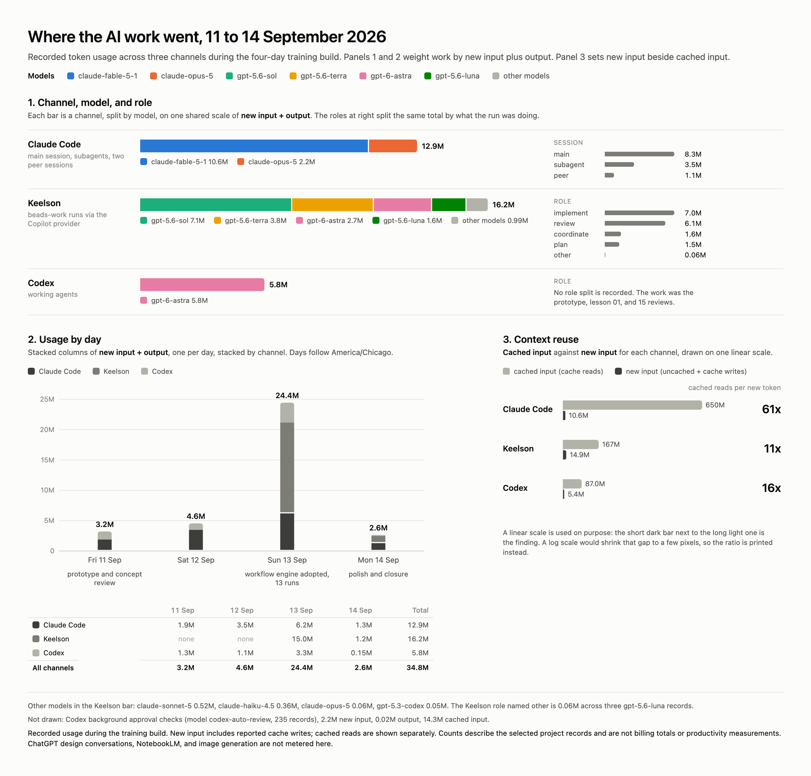

# Token and model usage

Where the AI work went during the build, from the three channels that keep a usage ledger: Claude Code, Keelson, and Codex. The chart is `usage-figure.png`; the data behind it is `usage.json`, assembled from `claude-usage.json` (a sanitized export of the Claude Code transcripts) and `codex-keelson-usage.json` (Codex's own export of its task ledger and the Keelson project ledger, prepared during its review of the case study).

## Scope and definitions

- **Window.** The project's first Codex task on 11 September 2026 through the Pages run for the final build commit `62be86e`, which started at 11:41 CDT on Monday 14 September. Days are America/Chicago.
- **Excluded.** The case-study research session and its subagents, the poster and figure work, ChatGPT design conversations, NotebookLM, and the Gemini image model. Those channels either keep no ledger the owner can read or were not part of the build.
- **New input** is uncached input plus reported cache writes. **Cached input** is cache reads. **Output** is output tokens; for Codex it already includes the reported reasoning subset, which is not added again.
- **Units differ.** A Claude Code turn is one model response. A Keelson record is one workflow node turn and can contain several responses. A Codex record is one response. Record counts are not comparable across channels; tokens are.
- These are provider-reported token counts. They are not a bill and they are not a measure of equivalent work across models. The Claude Code cost ledger in the appendix is the CLI's own running estimate; Keelson's usage is metered by the Copilot subscription; Codex is metered by its own.

## Totals by channel

| Channel                                     |        Records |  New input | Cached input |     Output | Cached share of input |
| ------------------------------------------- | -------------: | ---------: | -----------: | ---------: | --------------------: |
| Claude Code, all sessions                   |    3,097 turns |    10.59 M |      650.2 M |     2.30 M |                 98.4% |
| Keelson training project, via Copilot       | 224 node turns |    14.86 M |      166.6 M |     1.32 M |                 91.8% |
| Codex working agents                        |  710 responses |     5.35 M |       87.0 M |     0.43 M |                 94.2% |
| **Three channels**                          |                | **30.8 M** |  **903.8 M** | **4.05 M** |             **96.7%** |
| Codex background approval checks (separate) |  235 responses |     2.19 M |       14.3 M |     0.02 M |                       |

Three things stand out.

**The orchestrator wrote the most.** Claude Code's main session produced 2.03 M output tokens, more than the Keelson implementers (0.65 M for the implement role) and Codex (0.43 M) together. The orchestrator was writing content, briefs, tracker revisions, bead descriptions, and documentation, not only coordinating.

**Keelson consumed the most new input.** The implement node alone took 6.3 M new input tokens across 13 runs, because each run starts from a fresh context, reads the repository, and carries the captured diff through the review lanes. The three review lanes and re-review took another 3.5 M. Planning took 1.3 M.

**Almost all input was cached.** Across the three channels, 96.7% of input tokens were cache reads. Long sessions and long workflow runs re-read the same context on every turn; caching is what made a 2,373-turn orchestrator session affordable. Cache reads dwarf everything else on a linear chart, which is why the figure shows them in their own panel.

## Claude Code

| Channel                                                         | Turns | New input | Cached input | Output |
| --------------------------------------------------------------- | ----: | --------: | -----------: | -----: |
| Main sessions (the orchestrator and the earlier build sessions) | 2,373 |    6.28 M |      533.4 M | 2.03 M |
| Subagents                                                       |   494 |    3.41 M |       58.9 M | 0.07 M |
| Peer sessions                                                   |   230 |    0.90 M |       57.9 M | 0.19 M |

| Model                              | Turns | New input | Cached input | Output |
| ---------------------------------- | ----: | --------: | -----------: | -----: |
| claude-fable-5-1                   | 2,308 |    8.70 M |      477.3 M | 1.95 M |
| claude-opus-5 (the first two days) |   788 |    1.89 M |      172.9 M | 0.35 M |

By day, new input plus output: Friday 1.9 M, Saturday 3.5 M, Sunday 6.2 M, Monday 1.3 M.

## Keelson

| Role                                                       | Model                          | Node turns | New input | Cached input | Output |
| ---------------------------------------------------------- | ------------------------------ | ---------: | --------: | -----------: | -----: |
| implement (implement, apply fixes, fix validation, fix CI) | gpt-5.6-sol                    |         48 |    6.32 M |      130.0 M | 0.65 M |
| review lanes and re-review                                 | gpt-5.6-terra                  |         52 |    3.54 M |       13.3 M | 0.27 M |
| triage, coverage check                                     | gpt-6-astra                    |         39 |    1.21 M |        1.4 M | 0.04 M |
| plan, investigate                                          | gpt-6-astra                    |         13 |    1.27 M |        8.3 M | 0.19 M |
| review loop closure                                        | gpt-5.6-luna                   |         10 |    0.82 M |        5.7 M | 0.06 M |
| coordinate (classify, brief, report, create PR)            | luna, sonnet, haiku, sol, opus |         56 |    1.54 M |        6.5 M | 0.09 M |

By day: Sunday 13 September 13.8 M new input and 1.18 M output across 207 node turns; Monday 14 September 1.05 M and 0.14 M across 17. Forty-five Keelson records carry no cache-write field; the totals treat those as zero and the JSON preserves the count.

## Codex

| Task                                             | Responses | New input | Cached input | Output |
| ------------------------------------------------ | --------: | --------: | -----------: | -----: |
| Prototype and initial source work (11 Sep)       |       189 |    1.17 M |       23.5 M | 0.14 M |
| Initial site review                              |        33 |    0.11 M |              | 0.01 M |
| Training experience review                       |        55 |    0.23 M |              | 0.03 M |
| Fork feature review                              |        64 |    0.41 M |              | 0.04 M |
| Lesson 01 implementation                         |        28 |    0.10 M |              | 0.02 M |
| Iterative design, content, and usability reviews |       324 |    3.18 M |              | 0.19 M |
| Final site review                                |        17 |    0.14 M |              | 0.00 M |

All Codex work ran on gpt-6-astra: 138 responses at medium effort and 572 at xhigh. The prototype task on 11 September is the largest single Codex contribution by output and predates the first Claude session.

## How the numbers were produced

- `claude-usage.json`: every transcript under the project's Claude Code directory, including subagent transcripts, parsed line by line; assistant usage summed once per distinct message id (the CLI writes one line per content block); records after the cutoff and the excluded sessions dropped; days assigned in America/Chicago.
- `codex-keelson-usage.json`: prepared by Codex from its task ledger (usage summed once per response id, validated against the durable thread counters) and from the Keelson `usage_events` table filtered to the training project. Its README section inside the JSON's `definitions` and `provenance` fields explains the accounting.
- `usage.json`: the two combined, with the Keelson ledger re-read directly from the workbench database and grouped by day, model, and node role.
