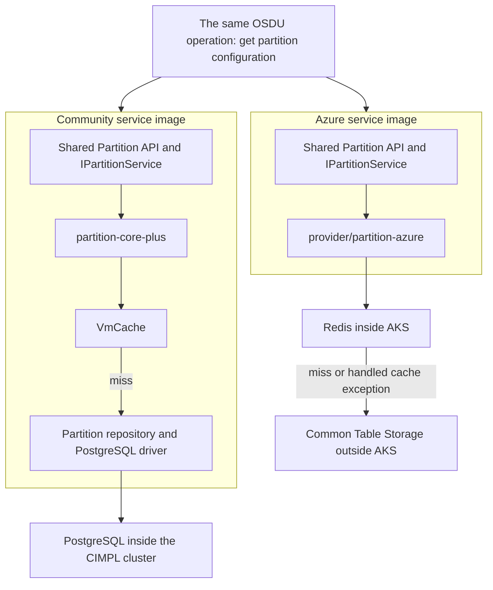

# CIMPL as the reference for Azure SPI training

## Recommendation

Use CIMPL, the open-source community implementation of OSDU, as a named reference throughout the training. Introduce it briefly, then use it where a difference explains the Azure implementation: the provider code inside a service, the resources that code calls, the ownership of a change, and the environment used to validate the resulting image.

The central story becomes more concrete: **an engineer recognizes an OSDU operation, sees how the community implementation serves it, then follows the Azure implementation through its dependencies, source fork, build, and validation.** The existing partition lookup and provider fix already support that story. They should remain the thread through the course.

Keep the present lesson sequence and visual direction. The comparison can fit into the existing opening explanation and selected claim, with a compact optional field guide for additional detail. It does not need another required lesson, another navigation mode, or a second architecture map on every page. Most lessons need one short comparison; Lesson 03 earns a more explicit view of both implementations.

Assume Try It participants have an Azure subscription and a GitHub account. Activities should still state the permissions, tools, prepared repositories, and environment state they require. The normal practical path should build and inspect Azure SPI. A paired CIMPL deployment is useful as optional exploration, especially on AKS, where keeping the hosting platform the same makes the implementation differences easier to see.

This is a learning-design recommendation. Its value is a clearer explanation of familiar operations and engineering responsibilities, not a ranking of the implementations or a claim of deployment, API, or release parity.

## What the current story is missing

The site already starts from OSDU APIs and partitions, follows one request, and separates the runtime from the source repositories. Its familiar-things guide translates known concepts into Azure resources. Those are useful foundations and should be retained.

The missing connection is an explicit reference implementation on the lesson surface. “You know OSDU” names the audience's conceptual knowledge, but does not establish which deployment or provider behavior can be assumed. An engineer familiar with CIMPL, an existing Azure deployment, or another provider will bring different assumptions to the same phrase. The training should introduce its reference rather than expecting everyone to have operated it.[^1]

The orientation source already explains CIMPL and the community/provider ownership relationship. Much of that explanation lives in optional media and its supporting documents, while the required lessons quickly become an Azure topology tour. Moving a small amount of that context into the lessons would improve the story without adding much text.[^2]

A suitable opening is:

> You know the OSDU APIs and data partitions. CIMPL provides the open-source community implementation. This course uses it as a reference while following the Azure provider code, the Azure resources it calls, and the forks and test environment used to maintain it.

That paragraph establishes the comparison without requiring CIMPL experience. It also gives the later fork lessons a purpose before they introduce branch mechanics.

## Compare the corresponding things

The comparison has three distinct subjects. Keeping them separate prevents several plausible misunderstandings.

| Subject                | Community reference                                                                                            | Azure SPI subject                                                                                               | Question it answers                                          |
| ---------------------- | -------------------------------------------------------------------------------------------------------------- | --------------------------------------------------------------------------------------------------------------- | ------------------------------------------------------------ |
| Service implementation | Shared service code with the community implementation, such as `partition-core-plus` and its PostgreSQL driver | Shared service code with `provider/partition-azure` and its Azure clients                                       | What handles the API operation and reaches its dependencies? |
| Running environment    | `cimpl-stack`: CLI bootstrap, Kubernetes workloads, Flux, and in-cluster middleware                            | `osdu-spi-stack`: Azure provisioning, AKS, Flux, in-cluster middleware, and Azure PaaS                          | What must be running for that implementation to work?        |
| Engineering workflow   | The relevant community service repository and its build/test pipeline                                          | The synchronized service fork, workflows supplied by `osdu-spi`, and validation against the backing environment | Where does a change belong, and what checks it?              |

These are corresponding responsibilities, not interchangeable repositories. The Azure service fork receives shared code from the community service repository. It does not receive that code from `cimpl-stack`, which is deployment tooling. Likewise, `osdu-spi` is the fork engineering system, while the provider implementation resides in each service fork.[^3][^4][^5]

The term _provider_ also needs a short contextual distinction. `cimpl up --provider azure` selects how the community stack is hosted. It does not select `provider/partition-azure` as the service implementation. CIMPL can run on AKS while continuing to use its community service artifacts and in-cluster dependencies. Hosting and service implementation are separate choices.[^3][^6]

Keep the existing explanation of the three uses of SPI available as reference. In ordinary lesson prose, use the concrete noun that applies: “Azure provider,” “SPI Stack,” or “fork workflows.” Readers should not need to resolve the acronym's meaning in every sentence.

## The differences that are worth teaching

| Concern                        | CIMPL reference at the reviewed revisions                                                       | Azure SPI at the reviewed revisions                                                                 | Learning consequence                                                                             |
| ------------------------------ | ----------------------------------------------------------------------------------------------- | --------------------------------------------------------------------------------------------------- | ------------------------------------------------------------------------------------------------ |
| Hosting                        | Can create or connect to Kubernetes on several substrates, including AKS                        | Provisions an Azure development/test environment with AKS and PaaS                                  | An AKS cluster alone does not identify the implementation.                                       |
| Bootstrap and reconciliation   | CLI prepares the cluster, inputs, and Flux; Flux and controllers manage subsequent work         | CLI and Bicep provision Azure and bootstrap Kubernetes; Flux and controllers manage workloads       | Reuse the operational model. Explain the additional Azure provisioning responsibility.           |
| Partition configuration lookup | `partition-core-plus` checks its configured `VmCache`, then its repository backed by PostgreSQL | Azure implementation checks Redis, then common Table Storage                                        | Compare the same request at the actual provider boundary.                                        |
| Entitlements persistence       | PostgreSQL connection and schema configuration                                                  | Shared Cosmos DB Gremlin                                                                            | The familiar groups remain; their persistence and credentials change.                            |
| Object storage                 | In-cluster S3-compatible storage; MinIO and SeaweedFS coexist in the reviewed stack             | Azure Blob Storage                                                                                  | Name the service and configured driver before asserting an exact substitution.                   |
| Search                         | Elasticsearch in the cluster                                                                    | Elasticsearch remains in the cluster                                                                | Some dependencies carry over. Azure SPI does not move everything to PaaS.                        |
| Events                         | RabbitMQ topology for community service messaging                                               | Azure Service Bus and Azure-specific consumers                                                      | Similar responsibilities have different clients, authorization, and failure paths.               |
| Identity                       | Keycloak for community API callers; credentials for middleware access                           | Entra-issued caller tokens plus separate workload identity for Azure resource access                | Explain inbound caller identity separately from outbound dependency access.                      |
| Service delivery               | Community OCI charts selected through service-specific references                               | Stack-owned service chart with image values supplied from `osdu-image-lock`                         | Identify the artifact and mutable control that determine the running image.                      |
| Source maintenance             | Community service repository owns its shared code and community implementation                  | Sync imports selected shared code while the fork maintains Azure-owned paths                        | A fix is routed by the code and responsibility it changes.                                       |
| Validation                     | Tests exercise the community implementation and its configured environment                      | The fork builds an Azure image; an eligible deployment test exercises it against Azure dependencies | A test result establishes behavior for the implementation and environment it actually exercised. |

The environment and middleware comparisons are supported by both stacks' architecture and configuration. The request comparison is supported by the service source, rather than inferred from an infrastructure diagram.[^3][^4][^7][^8][^9][^10] Delivery and ownership have separate evidence in the manifests, image resolver, and filter decision.[^5][^6][^11] Identity needs its own comparison because API caller authentication and access to a dependency are separate paths.[^17][^20]

Three details deserve special treatment:

**PostgreSQL does not translate to one Azure product in every context.** Partition configuration goes to Table Storage; entitlements uses Gremlin; other persistence responsibilities differ again. Airflow's PostgreSQL remains inside the Azure stack. A global “PostgreSQL becomes Cosmos DB” arrow would obscure the running example.[^4][^7][^9]

**The community registry is not the community implementation.** Azure SPI currently resolves its default service images from the community GitLab registry. CIMPL selects community implementation charts from that infrastructure too. Registry provenance, implementation variant, source revision, and image digest answer different questions. Label them separately in evidence and avoid using “community image” as shorthand for CIMPL.[^6][^11]

**Neither development stack's posture implies production readiness.** Both document development/test assumptions. The training can explain why managed Azure resources are necessary to exercise the Azure provider without implying that the SPI Stack is a hardened production deployment.[^3][^4]

## Make the partition lookup the central comparison

The strongest comparison uses the request already running through the course:

`GET /api/partition/v1/partitions/opendes`

The community partition source declares the API and `IPartitionService.getPartition`. Its `partition-core-plus` implementation calls a configured `VmCache`; on a miss, it reads properties through `OsmPartitionPropertyRepository`. The build packages a PostgreSQL plugin, and the stack supplies the PostgreSQL connection through its partition Secret. The Azure implementation implements the same named interface, checks Redis, and falls back to Table Storage.[^7][^8][^9][^12]

This is a comparison of two separately built service images. It is not a runtime switch between providers inside one deployed image. The arrows show a lookup that misses the cache; a hit can return without reaching the durable store. The PostgreSQL driver remains part of the community service process, while the database is outside that process.

The adjacent learner-facing explanation could be:

> Both implementations answer the partition API. The community implementation reads stored configuration from PostgreSQL after a cache miss. The Azure implementation checks Redis, then reads common Table Storage. The provider code determines which dependency is called and how the service reaches it.

This comparison improves the cache-fallback story too. A Redis connection failure is a concrete problem in the Azure path. The Azure implementation catches the cache exception and attempts the table read. Its success still depends on Table Storage being reachable and the partition existing. Do not copy that failure behavior onto the community implementation just because both have a cache.[^9]

Keep the lookup separate from the resources described by its result. It returns partition configuration; it does not call the partition's Cosmos DB, Blob Storage, and Service Bus while answering that request. Nor should the two responses be described as byte-for-byte equivalent: their implementation-specific properties can differ even when both correctly serve the same API operation.

For a live comparison, explicitly configure the same example partition name. CIMPL's configured default is `osdu`, and its `--partition` is independent of `--instance`. An environment, a deployment instance, a Kubernetes namespace, and an OSDU data partition must remain distinct concepts.[^10]

## Changes to the lesson sequence

### Start page

Keep the existing promise, action, and path cards. Replace a portion of the introduction with the short CIMPL framing above. Place an optional “CIMPL and the Azure implementation” field-guide link after the path, alongside the existing reference material.

The learner should enter Lesson 01 already knowing why there is a comparison. They should not need to listen to the orientation recording to understand the relationship. Avoid starting with Venus history, repository policy, or a full product matrix; those details become useful when source ownership enters the story.

### Lesson 01: the running stack

Keep “AKS is one part of the stack.” Its meaning becomes clearer when the reader can compare it with a CIMPL deployment, where the supporting middleware runs in Kubernetes.

Suggested introductory comparison:

> CIMPL runs its supporting middleware in Kubernetes. The Azure implementation also runs its APIs in Kubernetes, but reaches Azure data services outside AKS. Elasticsearch, Redis, and Airflow's database remain inside the cluster.

Follow that immediately with the existing Azure map. Keep the main claim about the resource group and the resources beside AKS. Add the community context to its reason rather than creating another claim solely to hold the comparison.

The partition claim should begin with the logical concept: a partition supplies the configuration and data context used by OSDU services. Then explain this stack's allocation of Azure resources. A partition is not universally defined as a Cosmos account, Storage account, and Service Bus namespace. Those are implementation choices in this Azure environment.[^4][^10]

The existing familiar-things guide is the natural place for a fuller comparison. In each expanded row, add a brief community-reference sentence before the Azure-specific evidence. The collapsed rows can stay compact. A wide, permanently visible three-column table would add too much reading before the map.

### Lesson 02: environment creation and operation

Start from the shared operational pattern: bootstrap, reconcile, inspect. Both stacks use a CLI, Flux, and controllers. The lesson can then spend its attention on Bicep provisioning Azure resources, obtaining the cluster identity information needed by later work, and preparing the inputs the Azure workloads consume.[^3][^4]

Suggested comparison:

> Both stacks prepare Kubernetes and hand workload reconciliation to Flux. SPI Stack also provisions the Azure data services and access its provider code needs. Check the resources, the workloads, and an authenticated API call separately.

A small ownership table would be more useful here than a command translation table. Show the CLI/Bicep responsibility, the Flux responsibility, and the controller responsibility, with a note about what is familiar from CIMPL. Keep the current lifecycle moments and readiness explanations.

The comparison must not teach that CIMPL updates continuously while Azure SPI is frozen. Both suspend their Git source after deployment, and suspension does not stop pods or all other controllers. CIMPL's service OCI references can still move independently; Azure SPI's image lock is a distinct input.[^11][^13]

Profiles also need explicit scope. Similar names do not guarantee matching service sets or costs. CIMPL profiles select service groups and inform sizing; SPI Stack profiles select Kubernetes workload scope while Azure provisioning still occurs. Keep detailed service matrices in the optional guide.[^4][^14]

### Lesson 03: the provider inside the service

This lesson should carry the most visible comparison. Keep the existing provider-inside-the-image headline and the Azure runtime map. Introduce the community implementation when the interface first appears, so SPI becomes an observed relationship rather than an acronym introduced in isolation.

Three suitable claims are:

| Claim headline                                          | Full claim                                                                                                                                             |
| ------------------------------------------------------- | ------------------------------------------------------------------------------------------------------------------------------------------------------ |
| Shared code calls a provider interface.                 | The Partition service calls `IPartitionService`; the community and Azure implementations connect that operation to different dependencies.             |
| The implementation ships inside the service.            | Each service image includes its selected implementation; calling the interface is an in-process call.                                                  |
| Azure dependency failures need Azure-specific handling. | The Azure lookup can continue after a Redis cache exception by reading common Table Storage, provided the table is reachable and the partition exists. |

The first claim's short reason can name the PostgreSQL/Table Storage difference. The optional comparison below it can show the paired lookup diagram. Required understanding stays visible when that detail is closed.

Use the evidence drawer for the provider class, cache configuration, packaging, and dependency credentials. Keep the next-lesson bridge about where Azure source is maintained. Detailed branch names and upstream deletion mechanics can wait for Lesson 04.

### Lesson 04: code ownership

The comparison gives this lesson a more durable opening than the pending removal of Azure directories:

> The community maintains the shared service code and its open-source implementation. The Azure fork receives shared-code updates and maintains the Azure provider alongside them. A change belongs with the code whose behavior it changes.

Retain the repository-by-owner map and three-branch explanation. Its question can become “Where does an Azure provider change belong, and how does it stay compatible with community code?” The upstream-removal history then explains the filter design in evidence instead of carrying the entire motivation.

Make the source flow explicit: community service repository → selected shared code → Azure service fork. The community `partition-core-plus` implementation is a comparison reference, but the Azure filter excludes it. It is not another Azure-owned directory or an extra adapter in the Azure image.[^5]

The governance note should reflect the final discussion on ADR 61: the recorded direction retains existing community repositories and removes provider-specific material, with timing still to be detailed. The issue's older proposal body and its final decision comment are different states. At the reviewed partition revision, the Azure directory is still present.[^15][^12]

### Lesson 05: a change through CI/CD

Begin with a change the reader can place: either shared Partition code changes upstream, or the Azure fork changes how it handles a dependency failure. Then follow the existing synchronization, integration, build, and validation sequence.

Suggested comparison:

> A community change is checked in its community pipeline. The Azure fork then has to integrate the shared-code update with its provider, build the combined service, and check that image against Azure dependencies.

Keep compilation and environment validation distinct. A build establishes that the selected source and dependencies can produce an artifact. Unit tests establish the cases they exercise. A deployment test establishes behavior against the backing environment it actually used. The environment is central to CI/CD validation, but not every build or test requires it.

Use the same example fix throughout. Avoid a second walkthrough of the community pipeline's stage names. Its role is to show what has already been checked and what the Azure workflow still needs to establish. A sync with no relevant change remains a valid result.

### Lesson 06: the backing environment

Keep the current image-lock, pod, and borrow/prove/restore map. One short comparison gives it purpose:

> A successful CIMPL run exercised the community implementation. This run deploys the Azure candidate and tests it against the Azure resources its provider calls. The result belongs to that image, those tests, and that environment.

An optional evidence comparison can pair `cimpl facts` with SPI's environment information: both help consumers discover deployment context rather than guess it. Their schemas, identity mechanisms, and readiness meanings are different. Their outputs are not interchangeable, and “facts available” is not the same as “all acceptance tests passed.”[^16][^17]

Retain the distinction between implemented workflow support and an adopted service workflow. The reviewed template ships a deploy-test lane; the reference partition fork has not adopted it or supplied its descriptor. A comparison should not turn that illustrative path into a claim of an observed successful run.[^17][^18]

### Lesson 07 and reference material

Add a small number of comparison-derived explanations to the existing field checks:

- AKS identifies the hosting platform; it does not identify the OSDU provider implementation.
- The registry hosting an image does not identify the implementation inside it.
- A data partition, deployment instance, and namespace describe different boundaries.
- A successful test applies to the implementation and dependencies it exercised.
- Git-source suspension leaves other reconciliation and runtime activity to their own controls.

Each should link back to the lesson that explains it. No new required exercise or comparison score is needed.

## A restrained presentation pattern

Use three levels of detail already familiar from the site:

1. **A sentence on the lesson surface.** Name the community reference and the Azure difference where it helps explain the selected claim. A practical editorial target is roughly 25–45 words, not a fixed new component on every lesson.
2. **An optional explanation in place.** Where useful, an accurately named disclosure such as “Compare the partition lookup” reveals the paired path or a few rows. It should have an immediate visible result without scrolling or opening another control surface.
3. **Source evidence in the existing drawer.** Link the specific implementation, manifest, or decision on each side. Keep required conceptual understanding outside the drawer.

Prefer a small paired diagram for Lesson 03 and a compact ownership table for Lesson 04. For the wide stack comparison, use one optional reference graphic with consistent positions for APIs, middleware, and external resources. Boundaries should remain visible, and orange should continue to mean fork-owned source rather than becoming a color for “all Azure things.”

On phones, stack paired explanations vertically with explicit labels. They should be readable without flipping a global CIMPL/Azure toggle or remembering an earlier screen. On desktop, side-by-side alignment is useful only when the components represent the same concern.

The current selected-claim and map interactions should remain primary. Do not place a new comparison panel ahead of the map on every lesson; that would make the existing distance between explanation and diagram worse. Replace generic prose with specific comparison prose where possible, rather than continuously appending content.

## Try It with Azure and GitHub available

The practical path can assume access to Azure and GitHub. The useful distinction is how much of the comparison an activity needs to demonstrate, not whether a participant has an account.

| Activity                                                         | What it would demonstrate                                                                                     | Recommended placement                                                         |
| ---------------------------------------------------------------- | ------------------------------------------------------------------------------------------------------------- | ----------------------------------------------------------------------------- |
| Inspect both partition implementations and their build inputs    | The same service interface is implemented by different code and dependency clients                            | Lesson 03's normal Try It; source inspection can precede or follow deployment |
| Create and inspect the Azure environment                         | Which dependencies are inside AKS, which are PaaS, and what the authenticated lookup actually reaches         | Lessons 01–02 practical path                                                  |
| Inspect a prepared CIMPL-on-AKS environment alongside Azure SPI  | Hosting on AKS does not select the Azure implementation; the middleware and credentials reveal the difference | Optional extension to Lesson 02 or 03                                         |
| Trace a controlled provider change through the personal fork     | Which paths are fork-owned and what build/validation jobs run                                                 | Lessons 04–05                                                                 |
| Deploy a candidate with a tested descriptor/workflow combination | Which digest was tested against Azure dependencies and what restoration did                                   | Lesson 06                                                                     |

A paired live comparison should use separately named environments. Keeping both on AKS controls the hosting variable, but does not make their AKS configurations, profiles, service counts, or resource consumption identical. It is an architecture comparison, not a performance benchmark.

Use the same API operation and explicitly configured example partition where practical. Record each environment's service version and image digest. Expect different endpoints, tokens, dependency configuration, and possibly returned properties. Demonstrate corresponding behavior without claiming identical configuration or automatically equivalent test coverage.

Do not require participants to provision two stacks just to learn the provider boundary. A source comparison plus their Azure environment can establish it. A prepared CIMPL environment or optional second deployment provides additional observation when it is worth the setup and continuing resource cost. The comparison should reduce uncertainty in the main exercise, not double every exercise.

Azure subscription access does not imply permission to create role assignments, register federation, or manage all resources. A GitHub account does not imply repository administration or permission to satisfy a protected-branch review rule. Name the exact access required by the selected recipe. Public community source can be inspected without making GitLab contribution access a new course prerequisite.

Each new live route still needs a recorded walkthrough: tested CLI and stack revisions, service artifacts, permissions, expected observations, alternate results, and cleanup. The optional two-environment route must also say which environment is being retained for a later activity. No new command sequence should be published by mechanically substituting `cimpl` for `spi`.[^10][^14][^17]

## Wording and source corrections to make alongside the comparison

The framing offers an opportunity to replace broad analogies with concrete engineering explanations.

| Existing or tempting wording                                     | More precise direction                                                                                                                 |
| ---------------------------------------------------------------- | -------------------------------------------------------------------------------------------------------------------------------------- |
| “OSDU stops and Azure begins.”                                   | “Where does shared service code call the Azure implementation?”                                                                        |
| “CIMPL has no cloud-provider technology in the deployment path.” | “CIMPL keeps its middleware portable; cluster creation and bootstrap can use provider-specific tools.”                                 |
| “Cosmos replaces PostgreSQL.”                                    | “For this partition lookup, common Table Storage holds the configuration that the community implementation reads from PostgreSQL.”     |
| “The same stack, with Azure services swapped in.”                | “The Azure service image contains provider code written for Azure dependencies, with different configuration and access requirements.” |
| “Every service gets a turn in the environment.”                  | “Eligible image builds enter the deployment-test lane when its prerequisites are met.”                                                 |
| “CIMPL passed, so the Azure implementation should work.”         | “CIMPL checked the community implementation. The Azure candidate needs tests that exercise its Azure path.”                            |

The introduction source currently uses sweeping middleware substitutions and a stronger portability claim than the implementation supports. Correct those in the source brief and any proposed new copy. Existing recordings should be replaced from an approved script; their transcripts should continue to represent the recording, with source-check notes handling interim corrections.[^2][^3]

The community repository itself also contains documentation at different stages of change. The architecture overview emphasizes MinIO, while current profiles deploy SeaweedFS as well; the SeaweedFS guide explicitly distinguishes substrate readiness from service activation. Profile service counts differ between documents. These are reasons to cite selected configuration and avoid fixed counts or universal product-pair arrows on the lesson surface.[^8][^14]

There is a further operational documentation conflict: the CIMPL reconciliation guide says an annotation can force a fetch while the GitRepository is suspended. The reviewed CLI's default reconcile path annotates that source without resuming it, while Flux documents suspension as preventing new artifacts. Treat that command behavior as requiring verification before placing it in Try It. The conceptual lesson—source suspension is narrower than freezing the environment—does not depend on that disputed recipe.[^13][^19]

## Recommended implementation order

First, revise the start-page introduction and the opening/context sentences in Lessons 01 and 03. Prototype only the optional paired partition explanation. These changes establish the reference, show the most useful difference, and expose whether the additional material improves comprehension without expanding the whole site.

Next, update the existing familiar-things guide with community context and precise Azure responsibilities. Add the short build-versus-validation explanation to Lessons 05–06, and make Lesson 04's source-ownership opening less dependent on the timing of upstream deletion.

Then align the Try It recipes with the comparison and verify their live routes. Keep detailed implementation differences, version notes, and source caveats in evidence. Revisit audio and posters after the lesson framing is settled, so they support the same story.

Useful review observations are whether a reader can explain why CIMPL may run on AKS, identify where the partition lookup reaches durable storage in each implementation, place a provider fix in the right repository, and say what an Azure deployment test adds to a community test result. These are questions for evaluating the material with readers, not a scored learner experience.

A small source-backed comparison record can support future maintenance: concept, community reference, Azure implementation, operational consequence, and both source revisions. Keep it keyed to existing chapters/components, not a parallel content hierarchy. Candidate edit locations are `src/content/chapters.js`, the familiar guide in `src/components/infographics.js`, `src/content/component-details.js`, and `src/content/sources.js`. Add a shared comparison renderer only if the first two examples demonstrate a repeated need.

## Evidence scope

The implementation comparisons are bounded to the following source snapshots, reviewed on 13 September 2026. The Azure revisions matched their public repository HEADs when checked. The community checkouts were obtained from the public repositories; no deployed environment or live test result is asserted.

| Repository                  | Revision                                                                 | Relevant date     |
| --------------------------- | ------------------------------------------------------------------------ | ----------------- |
| Community `cimpl-stack`     | `fe56aa1b13e9a15aee8af97f103484f8240a9cb3`                               | 11 September 2026 |
| Community Partition service | `5aa406b978dec178fe05f1c9a0ee0ca02eb239b4`                               | 11 September 2026 |
| `Azure/osdu-spi-stack`      | `dc2c95638ded6459538085cfdb2ada46b692c27b`                               | 11 September 2026 |
| `Azure/osdu-spi`            | `080f0b8289d6fc5519aa858531547e23287a280d`                               | 12 September 2026 |
| `Azure/osdu-spi-partition`  | `3a5690da3147d022ca9a2402858cd7b96e4688cf`                               | 2 September 2026  |
| Training content            | `b419e90`, with subsequent readiness changes through `3356774` inspected | 13 September 2026 |

Repository source establishes declared configuration and implemented behavior. It does not establish that the default registry artifact is built from that exact checkout, that two deployed services are release-matched, or that their acceptance suites have equivalent coverage. Those claims require the artifact and test evidence described above.

## Sources

[^1]: OSDU Fieldnotes, [chapter content](https://github.com/danielscholl-osdu/osdu-spi-training/blob/b419e90/src/content/chapters.js) and [familiar-things guide](https://github.com/danielscholl-osdu/osdu-spi-training/blob/b419e90/src/components/infographics.js), revision `b419e90`; read 13 September 2026.

[^2]: OSDU Fieldnotes, [Azure SPI introduction source](https://github.com/danielscholl-osdu/osdu-spi-training/blob/b419e90/docs/azure-spi-introduction-source.md) and [audio source notes](https://github.com/danielscholl-osdu/osdu-spi-training/blob/b419e90/docs/audio-source-notes.md), revision `b419e90`; read 13 September 2026.

[^3]: OSDU Cimpl Stack, [README](https://community.opengroup.org/osdu/platform/deployment-and-operations/cimpl-stack/-/blob/fe56aa1b/README.md) and [Architecture](https://community.opengroup.org/osdu/platform/deployment-and-operations/cimpl-stack/-/blob/fe56aa1b/docs/architecture.md), revision `fe56aa1b`, 11 September 2026. Selected configuration takes precedence over older inventory text.

[^4]: Azure, [SPI Stack architecture](https://github.com/Azure/osdu-spi-stack/blob/dc2c956/docs/architecture.md) and [in-cluster middleware scope](https://github.com/Azure/osdu-spi-stack/blob/dc2c956/docs/decisions/003-in-cluster-middleware-scope.md), revision `dc2c956`, 11 September 2026.

[^5]: Azure, [ADR-038: Upstream Filter Transform and One-Time Azure Seeding](https://github.com/Azure/osdu-spi/blob/080f0b8/doc/src/adr/038-upstream-filter-transform.md), accepted 25 August 2026, and [engineering-system overview](https://github.com/Azure/osdu-spi/blob/080f0b8/doc/src/architecture/overview.md), revision `080f0b8`.

[^6]: OSDU Cimpl Stack, [Partition OCIRepository and HelmRelease](https://community.opengroup.org/osdu/platform/deployment-and-operations/cimpl-stack/-/blob/fe56aa1b/software/stacks/osdu/services/partition/release.yaml), revision `fe56aa1b`, 11 September 2026. This identifies the `core-plus-partition-deploy` artifact independently of the Kubernetes hosting provider.

[^7]: OSDU Partition, [community PartitionServiceImpl](https://community.opengroup.org/osdu/platform/system/partition/-/blob/5aa406b9/partition-core-plus/src/main/java/org/opengroup/osdu/partition/coreplus/service/PartitionServiceImpl.java), [VmCacheConfiguration](https://community.opengroup.org/osdu/platform/system/partition/-/blob/5aa406b9/partition-core-plus/src/main/java/org/opengroup/osdu/partition/coreplus/cache/VmCacheConfiguration.java), and [OsmPartitionPropertyRepository](https://community.opengroup.org/osdu/platform/system/partition/-/blob/5aa406b9/partition-core-plus/src/main/java/org/opengroup/osdu/partition/coreplus/osm/repository/OsmPartitionPropertyRepository.java), revision `5aa406b9`, 11 September 2026.

[^8]: OSDU Cimpl Stack, [Secret generation and PostgreSQL bindings](https://community.opengroup.org/osdu/platform/deployment-and-operations/cimpl-stack/-/blob/fe56aa1b/src/cimpl/secrets.py) and [SeaweedFS design, including activation limits](https://community.opengroup.org/osdu/platform/deployment-and-operations/cimpl-stack/-/blob/fe56aa1b/docs/design/seaweedfs.md), revision `fe56aa1b`, 11 September 2026.

[^9]: Azure, [PartitionServiceImpl](https://github.com/Azure/osdu-spi-partition/blob/3a5690d/provider/partition-azure/src/main/java/org/opengroup/osdu/partition/provider/azure/service/PartitionServiceImpl.java), [RedisConfig](https://github.com/Azure/osdu-spi-partition/blob/3a5690d/provider/partition-azure/src/main/java/org/opengroup/osdu/partition/provider/azure/di/RedisConfig.java), and [DataTableStore](https://github.com/Azure/osdu-spi-partition/blob/3a5690d/provider/partition-azure/src/main/java/org/opengroup/osdu/partition/provider/azure/persistence/DataTableStore.java), revision `3a5690d`, 2 September 2026.

[^10]: OSDU Cimpl Stack, [Config and partition/instance fields](https://community.opengroup.org/osdu/platform/deployment-and-operations/cimpl-stack/-/blob/fe56aa1b/src/cimpl/config.py) and [ADR-029: Multi-instance](https://community.opengroup.org/osdu/platform/deployment-and-operations/cimpl-stack/-/blob/fe56aa1b/docs/decisions/029-multi-instance.md), revision `fe56aa1b`. Default names and namespace variants are configuration-specific.

[^11]: Azure, [implemented image resolution](https://github.com/Azure/osdu-spi-stack/blob/dc2c956/src/spi/images.py) and [Partition HelmRelease using image-lock values](https://github.com/Azure/osdu-spi-stack/blob/dc2c956/software/stacks/osdu/services/partition.yaml), revision `dc2c956`. OSDU Cimpl Stack, [release track selection](https://community.opengroup.org/osdu/platform/deployment-and-operations/cimpl-stack/-/blob/fe56aa1b/docs/decisions/042-release-track-selection.md), accepted 29 June 2026, revision `fe56aa1b`.

[^12]: OSDU Partition, [IPartitionService](https://community.opengroup.org/osdu/platform/system/partition/-/blob/5aa406b9/partition-core/src/main/java/org/opengroup/osdu/partition/provider/interfaces/IPartitionService.java), [community module POM](https://community.opengroup.org/osdu/platform/system/partition/-/blob/5aa406b9/partition-core-plus/pom.xml), and [community image Dockerfile](https://community.opengroup.org/osdu/platform/system/partition/-/blob/5aa406b9/partition-core-plus/build/Dockerfile), revision `5aa406b9`. The same checkout still contains `provider/partition-azure/`.

[^13]: OSDU Cimpl Stack, [Flux reconciliation](https://community.opengroup.org/osdu/platform/deployment-and-operations/cimpl-stack/-/blob/fe56aa1b/docs/design/flux-reconciliation.md) and [CLI reconcile implementation](https://community.opengroup.org/osdu/platform/deployment-and-operations/cimpl-stack/-/blob/fe56aa1b/src/cimpl/cli.py), revision `fe56aa1b`; Azure, [Flux reconciliation](https://github.com/Azure/osdu-spi-stack/blob/dc2c956/docs/design/flux-reconciliation.md), revision `dc2c956`. The command-level documentation conflict is bounded separately in this report.

[^14]: OSDU Cimpl Stack, [deployment profiles](https://community.opengroup.org/osdu/platform/deployment-and-operations/cimpl-stack/-/blob/fe56aa1b/docs/design/profiles.md) and [core profile manifests](https://community.opengroup.org/osdu/platform/deployment-and-operations/cimpl-stack/-/blob/fe56aa1b/software/stacks/osdu/profiles/core/stack.yaml), revision `fe56aa1b`. Exact counts in summary documents differ; the report does not treat them as a parity matrix.

[^15]: OSDU, [ADR 61: Venus Release Structure and Repository Strategy](https://community.opengroup.org/osdu/platform/ci-cd-pipelines/-/issues/61), created 16 June 2026, proposal updated 11 August 2026; final comment records the 25 August governance decision and leaves timing to further coordination. Issue and final discussion read 13 September 2026.

[^16]: OSDU Cimpl Stack, [instance facts](https://community.opengroup.org/osdu/platform/deployment-and-operations/cimpl-stack/-/blob/fe56aa1b/docs/design/instance-facts.md) and [CI validation](https://community.opengroup.org/osdu/platform/deployment-and-operations/cimpl-stack/-/blob/fe56aa1b/docs/design/ci-validation.md), revision `fe56aa1b`.

[^17]: Azure, [fork deployment contract](https://github.com/Azure/osdu-spi-stack/blob/dc2c956/docs/design/fork-deployment.md), [workload identity and request authentication](https://github.com/Azure/osdu-spi-stack/blob/dc2c956/docs/design/workload-identity.md), and [secret lifecycle](https://github.com/Azure/osdu-spi-stack/blob/dc2c956/docs/design/secret-lifecycle.md), revision `dc2c956`.

[^18]: Azure, [template validation workflow](https://github.com/Azure/osdu-spi/blob/080f0b8/.github/template-workflows/validate.yml), revision `080f0b8`, compared with [reference Partition fork validation](https://github.com/Azure/osdu-spi-partition/blob/3a5690d/.github/workflows/validate.yml), revision `3a5690d`.

[^19]: Flux, [GitRepository suspension](https://fluxcd.io/flux/components/source/gitrepositories/#suspend), documentation read 13 September 2026. Suspension prevents new source artifacts until resumed.

[^20]: OSDU Cimpl Stack, [Keycloak integration](https://community.opengroup.org/osdu/platform/deployment-and-operations/cimpl-stack/-/blob/fe56aa1b/docs/design/keycloak-integration.md) and [Partition chart authentication overrides](https://community.opengroup.org/osdu/platform/deployment-and-operations/cimpl-stack/-/blob/fe56aa1b/software/stacks/osdu/services/partition/release.yaml), revision `fe56aa1b`.
