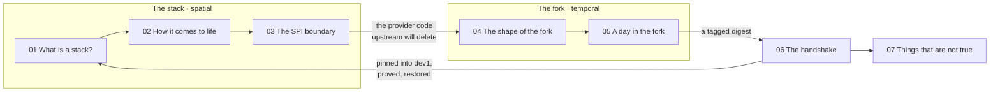

# Iteration 5 plan: two repositories, one answer

Status: agreed; phases 1–6 delivered, see ../iterations/iteration-5.md. Phase 2 (the spine) is being built first so the shape can be judged before guides and audio land on top of it.

Principles agreed before building: not so heavy that a reader cannot reach an understanding; not so shallow that an engineer finds it simplistic; no confusion between the three things called SPI; concepts grow in order and every one links to the documentation that holds the depth; graphics, audio, diagrams, and interaction before paragraphs; and the writing, drawing, and naming stay plain, specific, and human. Two adjustments to the views below follow from that: the ownership-through-the-tree drawing is the map for 04, with the branches beside it, and 06 draws only the running example's hops and keeps everything else inside components.

The site today teaches the SPI Stack: what a stack is, how `spi up` builds it, where inside a service OSDU stops and Azure begins, and (in one view) how a change reaches it. The new material doubles the subject. The complete guide (103 pages) adds the engineering system as a full book, and adds a third book about the seam where the two systems meet. Two generated posters and two generated audio overviews arrived with it.

This plan says how the site absorbs that without becoming two sites.

## The problem to solve

The engineering system and the stack are two different kinds of thing, and the site's current mental map only has room for one of them.

- The stack has a **spatial** map: a subscription, a resource group, data services beside a cluster, namespaces, one service. The site's six-place zoom ladder describes it, and the map renderer draws it.
- The engineering system has a **temporal** map: an upstream that changes daily, a generated branch, a workspace branch, a protected branch, a release tag, an image. Nothing in it is a place inside Azure. The ladder currently squeezes all of it into the sixth rung, "where the code comes from".
- The two meet at exactly one point: a digest written into `osdu-image-lock` by a fork's CI run, in an environment that the stack provisioned and that the fork borrowed.

The learner also arrives for two different reasons, and the guide confirms both are real:

1. **I want a running OSDU on Azure.** The stack alone does that. It pulls service images by digest from GHCR and can point any service at community images or fork images (`spi onboard --canonical-source`). It does not need the engineering system.
2. **I maintain, or mirror, a service fork.** The engineering system does that, and it cannot prove anything without a stack to borrow. It needs the stack.

That asymmetry is the single most important sentence the site does not yet say: **the stack stands alone; the engineering system does not.**

## The organizing device: one round trip

Keep one spine. Do not build a second track for the engineering system, and do not reorder to put the fork first. The current on-ramp (an API request on a running stack, which an OSDU engineer already understands) is the right one, and the guide's own prologue agrees that the reader should meet the problem before the machinery.

Instead, extend the running example into a loop that every view is one segment of:

The lookup for `opendes` in `dev1` goes **down** the stack (views 01 to 03) and ends at the fork-owned provider. A fix to that provider goes **out** to the fork (04, 05), and **back in** through the image lock (06). The last view stays where it is: the contradictions, now from both books.

The chapter rail keeps its numbering and gains a book kicker above each cluster ("The stack", "One service", "The fork", "The seam"), so the loop is visible in the navigation without a new control. Nothing on the start page competes with the path; the loop figure replaces the current position of the ladder and the ladder becomes one half of it.

## The views

### 01 What is a stack? and 02 How it comes to life

Unchanged in structure. Two content additions:

- 01 says, in its scope line, that the stack does not depend on the engineering system: images arrive by digest from GHCR, and each service's canonical source is a choice recorded on the resource group (`spi-source-<service>` tag).
- 02's "Use the stack" moment gains one sentence and one detail: onboarding forks is optional. `spi onboard <service> --repo <org>/<fork>` adds a federated credential on `spi-stack-<env>-deployer` and two namespace Roles; up to 19 repositories per environment; identities survive `spi down` so onboarded forks keep working across rebuilds.

### 03 The SPI boundary

Unchanged. It is already the hinge: its closing note says upstream plans to remove its Azure implementations and "how that code travels is the next view". That promise is now kept by two views instead of one.

### 04 The shape of the fork (new, map kind)

Question: _Who owns that provider code, and how does it survive upstream deleting it?_
Builds on: the fork-owned paths from 03.
Where: outside the stack entirely, in GitHub and on community.opengroup.org.

A new diagram renderer (`fork`) with clickable components, drawn as geography rather than a flow:

- **Upstream** (community GitLab): the whole service, including AWS, GCP, IBM, and, for now, an Azure provider.
- **The filter** (`.github/upstream-filter.yml`): kept, stripped, and protected paths. Halts on unknown paths (exit 2, labels `sync-failed` and `human-required`).
- **`fork_upstream`**: generated, never merged into. Trailers `Upstream-Sha` and `Filter-Rev`. Builds `core` only.
- **`fork_integration`**: disposable workspace, reset to `main`. Where a fork-owned fix and an upstream change meet.
- **`main`**: protected. Required checks named exactly `CodeQL` and `Validation Summary`. Rulesets reconciled by `Settings Apply` on Mondays.
- **The tree**: fork-owned (`provider/<svc>-azure`, `testing/<svc>-test-azure`, `.github/`, `build/`, `.spi/`) versus upstream-owned (`<svc>-core`, shared build config, community acceptance tests) versus stripped.
- **The template** (`Azure/osdu-spi`): `.github/workflows/` runs only in the template; `.github/template-workflows/` is what forks receive. `Sync Template` at 08:00 UTC.
- **The mirror fork** (second tier): a true GitHub fork of the service repo, `SYNC_MODE=mirror`, `Filter-Rev: mirror`, template sync off, five-step round trip back to the service repo.
- **The image** (GHCR, public): one canonical `build/Dockerfile`, default JAR `provider/<svc>-azure/target/*-spring-boot.jar`. Digest, not tag.

Running example hops: the fix on a feature branch in `osdu-spi-partition` → PR to `main` → `CodeQL` and `Validation Summary` → merged → and, in parallel, an upstream change to `partition-core` waiting in `fork_upstream`.

Easy mistake beside the map: "a fork is a snapshot" (it is a relationship, regenerated daily).

Outcomes: three branches, three jobs; the fork owns the Azure subtree and nothing else; a mirror fork is a customer's copy of the service repo, not a second fork of upstream.

### 05 A day in the fork (new, map kind, with moments)

Question: _What happens to that fix, and to upstream's change, between midnight and a release?_
Builds on: the branches from 04.
Where: the same map as 04, stepped through in time.

This reuses the lifecycle mechanism from 02 (moments keyed in the URL, guides keyed by moment) on the fork map. The parallel is deliberate: 01/02 are the stack's shape and life; 04/05 are the fork's shape and life.

Moments:

1. **00:00 UTC, Sync Upstream.** `git read-tree` → `checkout-index` → `upstream-filter` → `commit-tree` with two parents. Branch `sync/upstream-YYYYMMDD-HHMMSS`, PR "Sync with upstream <version>", tracking issue carrying `<!-- upstream-sha: … -->`, variable `SYNC_LAST_EVALUATED_SHA`. Meta commit rule: breaking > feat > fix.
2. **Cascade Integration.** Merges `main` into `fork_integration` first, then `fork_upstream`. Build `-P core,azure` (never bare `-P azure`). Opens `release/upstream-*` PR labeled `validated`.
3. **Labels as the state machine.** `cascade-active`, `cascade-blocked`, `human-required`. Removing `human-required` is the retry signal. `Cascade Monitor` every six hours. This moment's guide is the label transition diagram.
4. **Human review and merge to `main`.**
5. **Release.** Release Please tags; correlation tag `<release-tag>-upstream-<upstream-version>`; the image is retagged, not rebuilt.
6. **08:00 UTC, Sync Template.** Engineering-system changes propagate from `osdu-spi` as reviewable PRs. Monday 04:00 `Settings Apply`; weekly `GHCR Retention`.

Running example: the fix and the upstream change meet in `fork_integration` at moment 2 and leave together at moment 5 as one tagged digest.

Easy mistakes, keyed by moment: "merge `fork_upstream` to fix a conflict" (sync), "`-P azure` builds the provider" (cascade), "removing `human-required` does nothing" (labels), "a release rebuilds the image" (release).

Outcomes: a sync is a generated tree plus one PR, not a merge; the labels are the state and the audit trail; the digest that leaves the fork is the one that 06 will borrow a slot for.

### 06 The handshake (rebuilt from today's view 04)

Question: _How does that digest reach a running stack, what proves it, and what gives the slot back?_
Builds on: the digest from 05 and the environment from 01.
Where: both maps at once. The diagram draws the fork's CI run on the left and `dev1` on the right, joined at the lock.

Today's three-lane engineering diagram becomes the seam diagram. Components:

- **Three contracts, three owners.** Facts (`spi info --json`, `spi status --json`, `apiVersion: spi.osdu.dev/v1`), owned by the stack. Descriptor (`.spi/service.yaml`), owned by the fork. Machinery (actions and `validate.yml`), owned by the template. Only five repository settings: three identity secrets and `SPI_STACK_RESOURCE_GROUP`, `SPI_STACK_CLUSTER`.
- **Trust before anything runs.** The federated credential from `spi onboard`, subject `repo:<org>/<fork>:environment:spi-stack`. Roles `spi-fork-deployer` (patch `osdu-image-lock` only) and `spi-fork-verifier` (read).
- **deploy-gate.** No credentials. Requires push or same-repo PR, onboarded, descriptor present, image pushed. Rejects `fork_upstream` and Dependabot. Not onboarded is a visible skip, and the summary stays green.
- **The status envelope.** `ready`, `deployable`, `reason.code` from a closed set (`kustomization_not_ready`, `maintenance`, `missing_deploy_record`, `bootstrap_failed`, `bootstrap_pending`).
- **The client matches the environment.** Read `.environment.stackVersion` and reinstall that exact `spi`.
- **Borrow.** `spi service pin --image ghcr…@sha256 --ephemeral --run-id …`, a compare-and-set on the lock, annotation `spi-stack.osdu.dev/pins`. Concurrency group `spi-stack-<service>`, `cancel-in-progress: false`. Refusal semantics: if refused and the environment is still deployable, fail now; if it became undeployable, wait up to ten minutes.
- **Verify.** `spi service verify` polls the pod's `imageID`; `lock_mismatch` fails fast.
- **Prove.** Three tokens minted by the run; `resolve.py --contract-only` then per suite; `docker run --env-file <suite>.env <svc>-acceptance@<digest>`. Seeded data in three tiers: bootstrap, named loads, per-run fixtures.
- **Restore.** `spi service reset --if-run $GITHUB_RUN_ID` on `if: always()`; exit 2 means another run owns the pin and is treated as success. Weekday sweep clears ephemeral pins older than three hours whose run is gone.
- **Shared hazards.** A sibling's restart mid-run; a broken-but-ready fork image breaks siblings' suites.

Running example hops (the current five, rebuilt): tagged digest → gate → pin into `dev1` → pod running it → suites pass → slot restored.

Easy mistake: "green `Validation Summary` means it was deployed" (the deploy lane can skip visibly and the summary is still green).

Outcomes: the lock write is the whole deploy; a run only restores what it still owns; the stack publishes facts and the fork declares needs, and neither pushes values into the other.

Route stability: `#engineering-system` and its `?detail=` values must keep resolving. Add an alias table in the router that maps the old key to 06 and the old detail IDs to their new homes.

### 07 Things that are not true

Extend from eleven entries to roughly twenty, adding two themes: "The fork and its branches" and "The seam". Candidates from the Epilogue and Book Three, each traceable to a page or an ADR:

- A fork is a snapshot.
- `git merge` is how upstream arrives.
- `-P azure` builds the Azure provider.
- Removing `human-required` does nothing.
- A release rebuilds the image.
- Green `CodeQL` means the code was analyzed (the summary job can pass without analysis).
- Green `Validation Summary` means the deploy lane ran.
- Descriptor `requires.*` gates the lane (explicitly not wired yet).
- Restore always puts the previous image back (only if the run still owns the pin).
- The shared environment is rebuilt weekly by automation (it is operator policy; the scheduled workflows are unbuilt).
- `ErrImagePull` is a stack problem (GHCR visibility flipped; `Settings Apply` can only report it).
- `ready`, `deployable`, and `seeded` are the same verdict.

## The start page

One promise, one action, as today, but the promise changes:

> Two repositories, one answer. A stack you can bring up in an hour, and a fork that keeps the Azure code alive. Follow one request down the stack, then one fix all the way back in.

Then the path (seven views). Then, where the ladder is now, **the round trip figure** with the ladder as its left half and the fork map as its right half, joined at the lock. Then the three meanings of SPI (unchanged, now mapping cleanly to the three books: Stack → 01, interface → 03, engineering → 04). Then two doors, as reference rather than as a fork in the path:

- **Just bring up OSDU on Azure.** Views 01 and 02 are enough. You never touch the engineering system.
- **Maintain or mirror a service fork.** Views 03 to 06. You will need a stack to prove against.

## Field guides

### Supplied posters (two new)

Both are Gemini-generated and go into `docs/reference/posters/` and `public/posters/` unchanged, with captions that record what differs from the documentation. That caption will be longer than usual. Known differences on first inspection:

| Poster                                    | Wording on the poster                                                                | Documentation                                                                           |
| ----------------------------------------- | ------------------------------------------------------------------------------------ | --------------------------------------------------------------------------------------- |
| Architecture of a Permanent Azure Fork    | "CITOPS LOCK-FILE"                                                                   | The term appears in neither repository. The object is `osdu-image-lock` in `osdu-flux`. |
| Architecture of a Permanent Azure Fork    | "Every day at 00:00 UTC, a Sync Template workflow propagates bug fixes"              | `Sync Upstream` runs at 00:00 UTC; `Sync Template` runs at 08:00 UTC.                   |
| Architecture of a Permanent Azure Fork    | "1,306 pre-loaded schemas"                                                           | About 1,386.                                                                            |
| Architecture of a Permanent Azure Fork    | Typos: "Kay Vault", "Kopt & Updated", "processr-required", "hardcuded", "Every tine" | Spelling only; the caption says so once.                                                |
| Engineering System for Continuous Forking | "Manual forks synchronize monthly"                                                   | The guide contrasts with manual forking generally; no monthly cadence is documented.    |
| Engineering System for Continuous Forking | "Deploy gate → citops lock-file"                                                     | Same as above.                                                                          |

The first poster is the whole thesis in one picture and belongs beside 06 and on the guides page. The second belongs beside 04 and 05.

### Native guides (new, HTML and SVG in `infographics.js`)

Each states one idea, names its sources, and links the view that explores it.

| Guide                              | Shape                                                             | Sits beside          | Grounded in                                                            |
| ---------------------------------- | ----------------------------------------------------------------- | -------------------- | ---------------------------------------------------------------------- |
| Ownership through the tree         | comparison table, three rows                                      | 04                   | ADR-038, `three_branch_strategy.md`, `.github/upstream-filter.yml`     |
| A day in the fork, on the clock    | timeline with scheduled and event-driven work labelled separately | 05                   | `workflows/synchronization.md`, `cascade.md`, `release.md`, Appendix C |
| Labels as the state machine        | transition diagram, each label a node                             | 05, labels moment    | ADR-019, ADR-020, ADR-022                                              |
| Two tiers, one round trip          | comparison table plus five numbered steps                         | 04, mirror component | `fork_tiers.md`, ADR-039, `workflows/adoption.md`                      |
| Three contracts, three owners      | three columns joined at a run                                     | 06                   | ADR-040, `deploy_test.md`, stack ADR-030                               |
| The stack stands alone             | two boxes, one arrow, one dotted arrow                            | start page           | `fork-deployment.md`, stack ADR-033                                    |
| Green does not mean what you think | five checks, what each proves                                     | 07                   | Epilogue pp. 83–86                                                     |

### Posters built for this site (one new, one revised)

- **The seam: one image, one borrowed slot.** A path with a gate, a lock, and a return. Built with the infographic skill's schematic language from ADR-041, stack ADRs 031 and 032, and `fork-deployment.md`. Replaces the need to explain the lane in prose beside 06.
- **Borrow, Prove, Restore** (adopted from osdu-spi) keeps its place, and its caption is updated with what has been built since: the status envelope, `--if-run`, refusal semantics, the three-hour sweep, and what still is not wired (Key Vault materialization, `requires.*` enforcement, drift tripwire).

## Listen

Three episodes now. The player and dock hold one `audio` object; generalize to a list of episodes with the current one in the URL (`#listen?episode=forks&t=764`). The dock names the episode and the marker. One element, one playing episode, never auto-navigating, as today.

| Episode                                   | Source                                                                   | Length | Prep                        |
| ----------------------------------------- | ------------------------------------------------------------------------ | ------ | --------------------------- |
| Engineering the OSDU SPI Stack on Azure   | stack guide                                                              | 58:36  | done                        |
| Why Azure 3D prints Git branches          | presumably the osdu-spi guide (the title is the generate-not-merge idea) | 69:00  | transcode, transcribe, mark |
| The Azure OSDU service provider interface | presumably the complete guide                                            | 56:18  | transcode, transcribe, mark |

Preparation steps, matching how the first episode was done:

1. Transcode to mono AAC at the existing rate (about 57 kb/s). The originals are stereo at 256 kb/s, 109 MB and 133 MB; transcoded they will be roughly 24 MB and 28 MB. `ffmpeg` is installed.
2. Transcribe to VTT. No Whisper build is installed on this machine; install one (`mlx-whisper` or `whisper.cpp`) or transcribe elsewhere. Keep the VTT in `docs/reference/` and regenerate `transcript.js` per episode with the same paragraph grouping.
3. Confirm which guide each episode was generated from by listening to the first few minutes, then write markers. Every marker links a site view; where the narration rounds a number or overstates, the note says what the source claims. The guide's own carefulness list (below) is the checklist for those notes.
4. Decide audio hosting. The first episode is committed to Git at 26 MB. Three episodes is about 80 MB in history. That is workable for GitHub Pages, but this is the moment to decide whether to keep committing audio or serve it from a release asset. Recommendation: keep committing for now, note the decision in `docs/audio-source-notes.md`, and revisit if a fourth episode appears.

## Claims that need a source check wherever they appear

The complete guide is candid about these, and the site must not be less careful than its source.

- The weekly rebuild of the shared environment is described as practice in Books Two and Three; page 82 says the scheduled reset and teardown workflows are unbuilt. Teach it as policy.
- `spi onboard --canonical-source` works; the promotion backstop that enforces it does not yet exist.
- Descriptor `requires.*` does not gate the lane today, even though the descriptor chapter reads as if it does.
- Green checks that prove less than they look like: `CodeQL` summary, `Validation Summary` with a skipped lane, smoke teardown (`az group delete --no-wait || true`), `Ready=True` on cached artifacts, a certificate passing health with HTTPS closed.
- Durations: summing the timing table gives the wrong wall clock. 45 to 50 minutes is measured; the rest are budgets.
- `ready`, `deployable`, and `seeded` are three verdicts.
- `fork_upstream` builds `core` only in the first tier and the full profile in a mirror.
- `spi reconcile` does not resume a suspended source; `--resume` does.
- Restore is conditional on still owning the pin.
- The engineering ADR register runs to 041 with three retired, so it holds 38; a learner who counts will notice the gap.

## Sources to add

`sources.js` cites six osdu-spi documents today. The new views need, from osdu-spi: `architecture/deploy_test.md`, `architecture/workflow_system.md`, `workflows/{initialization,synchronization,cascade,validation,build,release,adoption}.md`, `runbooks/{fork-lifecycle,service-descriptor}.md`, `adr/learnings.md`, and ADRs 001, 019, 020, 022, 023, 033, 036, 039, 040. From osdu-spi-stack: decisions 030, 032, and `design/bicep-architecture.md`. The integrity test that checks source files against sibling checkouts already covers these once they are listed.

## Sequence

Each phase leaves `main` deployable and passes `npm run check`.

1. **Reference material.** Copy the two posters to `docs/reference/posters/` and web-sized copies to `public/posters/`; transcode the two audio files; add the new source keys; add the complete guide's outline to `docs/audio-source-notes.md`. No learner-visible change.
2. **The spine.** Split today's view 04 into 04, 05, and 06 with the `fork` renderer, moments on 05, the seam diagram on 06, the extended running example, the router alias, the book kickers in the rail, and the new start-page promise and round-trip figure. Component details for every clickable element. This is the largest phase and the one to review at 1440 and 390 pixels before anything else lands on top of it.
3. **Field guides.** The two supplied posters with their captions, the seven native guides, the seam poster, and the revised Borrow, Prove, Restore caption. Wire guides to views and moments.
4. **Listen.** Multi-episode player, transcripts, markers with source-check notes for both new episodes.
5. **Not true.** The new entries and themes, and the easy-mistake callouts on 04, 05, and 06.
6. **Tests and record.** Integrity tests for: moments on the fork map, alias routes, one transcript and marker set per episode, every new guide keyed to a real view or moment, every new myth themed to a view. Write `docs/iteration-5.md` from what was actually built.

## Alternatives considered

- **A second track for the engineering system**, entered from the start page beside the stack track. Rejected: the seam is the point, and two tracks put it at the end of both.
- **Reorder to fork first**, matching the guide's Book One. Rejected: an OSDU engineer's on-ramp is a request on a running system, and view 03 is the natural hinge into the fork.
- **One larger view 04** with everything about the fork. Rejected: the fork's shape and its daily cadence are different questions on different axes, exactly as 01 and 02 are for the stack.
- **A persona chooser on the start page.** Rejected: iteration 4 found the first visit too heavy. The two doors are reference below the path, not a decision before it.

## Risks

- First-visit weight. Seven numbered views instead of five. Mitigation: the book kickers group them, each view keeps one question, and the two doors tell a bring-up-only reader they can stop after 02.
- Repository size from audio. See the hosting decision above.
- Transcription tooling is not installed. The Listen phase cannot start until it is.
- The generated posters contain errors. Captions must carry them; the posters are visual references, not authority, as `AGENTS.md` already says of the CIMPL ones.
- Which guide produced which audio is an assumption until the audio is heard.
